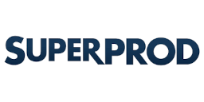
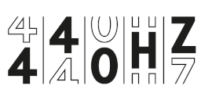
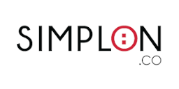
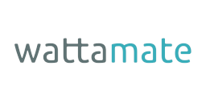
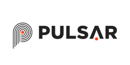

# Clients

Here are some of the companies I have been working with in the past.

!!! info

    I am currently under contract with several companies.
    However, I am always open to new opportunities and challenges
    so feel free to [contact me](../contact.md)!

[{ align=left .client-icon }](https://www.superprod.net "Superprod Website")

**Software & Data Engineering**

Data Management · Project Management · Tech Training · Python · Django · Docker · Elasticsearch ·

---

[{ align=left .client-icon }](https://weare440.com "440Hz Website")

**Software & Data Engineering**

Data Engineering · Python · ETL · Web-Scraping · Docker · Cloud · DevOps

---

[{ align=left .client-icon }](https://simplon.co "Simplon.co Website")

**Data / AI Training**

Data Analysis / Engineering / Science · Agile Project Management · Python · SQL / NoSQL · ETL · Cloud · Active Learning

---

[{ align=left .client-icon }](https://wattamate.com "Wattamate Website")

**Backend Software Development**

Microservices · DevOps · CI/CD · Cloud · Security · Python · SQL / NoSQL · Docker · Kubernetes

---

[{ align=left .client-icon }](https://pulsar.audio "Pulsar Website")

**Audio Software Development**

Software Architecture · Digital Signal Processing · C++ · CMake · OpenGL · JUCE · VST/AU/AAX
