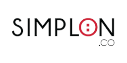
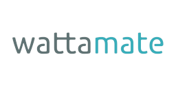
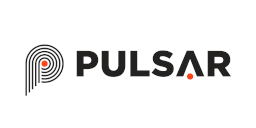

# Clients

Here are some of the companies I have been working with in the past.

!!! info

    I am currently under contract with several companies.
    However, I am always open to new opportunities and challenges
    so feel free to [contact me](/contact/)!

## Superprod

[{ align=right style="width: 20%" }](https://www.superprod.net "Superprod Website")

**Software & Data Engineering**

- [x] Project Management
- [x] Data Management
- [x] Tech Training
- [x] Python
- [x] Django
- [x] Docker
- [x] Elasticsearch

---

## 440Hz

[{ align=right style="width: 20%" }](https://weare440.com "440Hz Website")

**Software & Data Engineering**

- [x] Data Engineering
- [x] Python
- [x] ETL
- [x] Web-Scraping
- [x] Docker
- [x] Cloud
- [x] DevOps

---

## Simplon.co

[{ align=right style="width: 20%" }](https://simplon.co "Simplon.co Website")

**Data / AI Training**

- [x] Data Analysis / Engineering / Science
- [x] Agile Project Management
- [x] Python
- [x] SQL / NoSQL
- [x] ETL
- [x] Cloud
- [x] Active Learning

---

## Wattamate

[{ align=right style="width: 20%" }](https://wattamate.com "Wattamate Website")

**Backend Software Development**

- [x] Microservices
- [x] DevOps
- [x] CI/CD
- [x] Cloud
- [x] Security
- [x] Python
- [x] SQL / NoSQL
- [x] Docker
- [x] Kubernetes

---

## Pulsar

[{ align=right style="width: 20%" }](https://pulsar.audio "Pulsar Website")

**Audio Software Development**

- [x] Software Architecture
- [x] Digital Signal Processing
- [x] C++
- [x] CMake
- [x] OpenGL
- [x] JUCE
- [x] VST/AU/AAX
