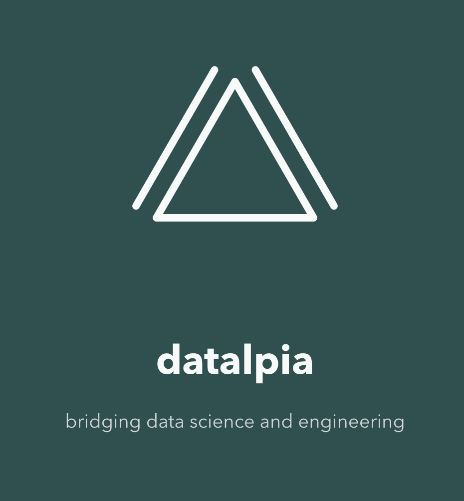

<!-- _header: "" -->
<!-- _footer: "" -->
<!-- _paginate: false -->

# Data Science and Engineering: We Were on a Break!

> **Romain Clement**

> Compute! Paris 2026
> November 26th 2026

---

<!-- _backgroundColor: #F6BC3B -->
<!-- _color: white -->
<!-- _header: "" -->
<!-- _footer: "" -->

# ✨️ Once upon a time...

<!--
Once upon a time, long before the Python programming language and its vibrant ecosystem became the go-to stack for all Data and AI related activities, researchers and engineers were using ancient tools to design and develop software processing solution in collaboration...

<picture of funny-looking teenagers Ross and Rachel, not quite fitting in their shoes>

Researchers were designing custom digital filters and implementing machine learning models from scratch everytime in MATLAB (and the more adventurous would also use the free software alternative "Octave").

On the other end, engineers were integrating processing algorithm in software products developped mostly with the C, C++ and sometimes Assembly languages for maximum runtime performance fine-tuning. Also, floating-point computations were a no-go, forcing everyone to think in terms of fixed-point processing (aka computing everything as integer while simulating mantissa).

Needless to say, porting experimental MATLAB implementations to production-grade C++/Assembly implementation was rough for everybody, often requiring back-and-forth and fixes to the core processing to meet production requirements.
-->

---

# 🐍️ The snake comes along

<!--
By 2015, the Data Science field exploded in popularity and the Python ecosystem took over the world. Everyone though this was going to be long-awaited messiah to all issues faced with collaboration between researchers and engineers, reducing time to production from months to days, benefitting from a single programming language with native library bindings for performance tuning, and even compatibility with embedded devices, all of that in a free software ecosystem ensuring extensive community earnings! The future was bright! Right? Right?...

<picture of Ross and Rachel first kiss as adults>
-->

---

---

## Romain CLEMENT

Indepedent consultant at **Datalpia**

Meetup Python Grenoble co-organizer

🌐 [datalpia.com](https://datalpia.com)
🌐 [romain-clement.net](https://romain-clement.net)
🔗 [linkedin.com/in/romainclement](https://www.linkedin.com/in/romainclement)

---

# 🙋 Questions ?

Thank you! Let's chat!

---

## 📚 References
