<!-- _header: "" -->
<!-- _footer: "" -->
<!-- _paginate: false -->

# My right to repair a MacBook Pro

> **Romain Clement**

> PyData Paris 2024
> Lightning Talk

> 26 September 2024

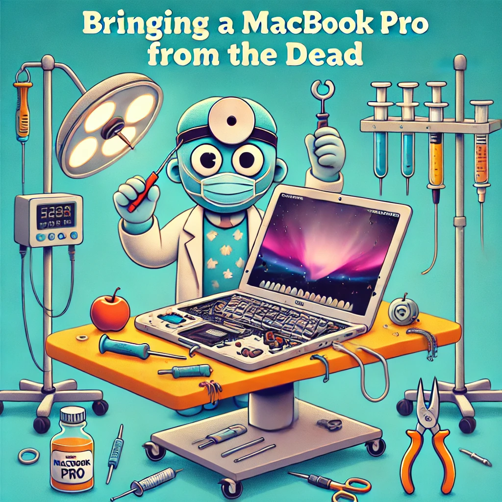

---

## MacBook Pro 2015 13'

- Daily driver since may 2017
- Bad thermal management
- Inflated / swollen battery
- Keyboard failure

---

## 🤓 Thermal Paste Replacement

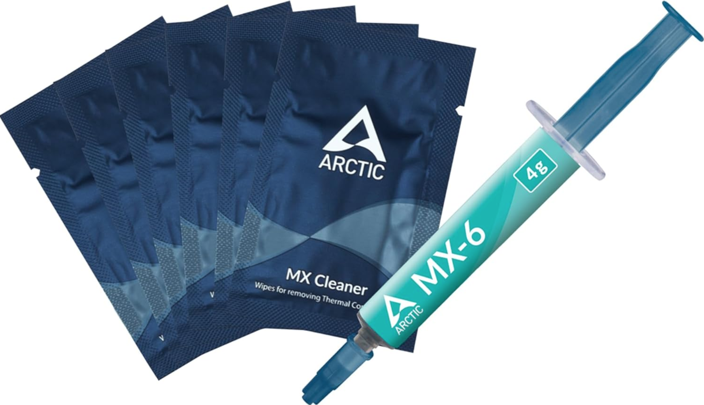

---

<!-- _header: "" -->
<!-- _footer: "" -->

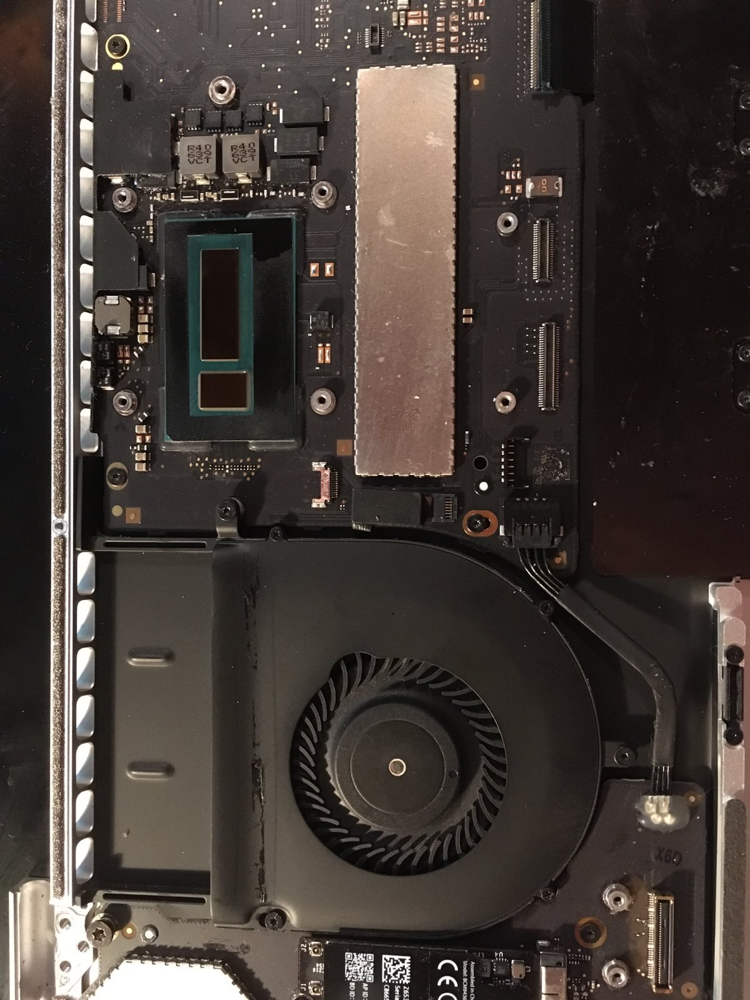

---

## 😭 Battery Replacement

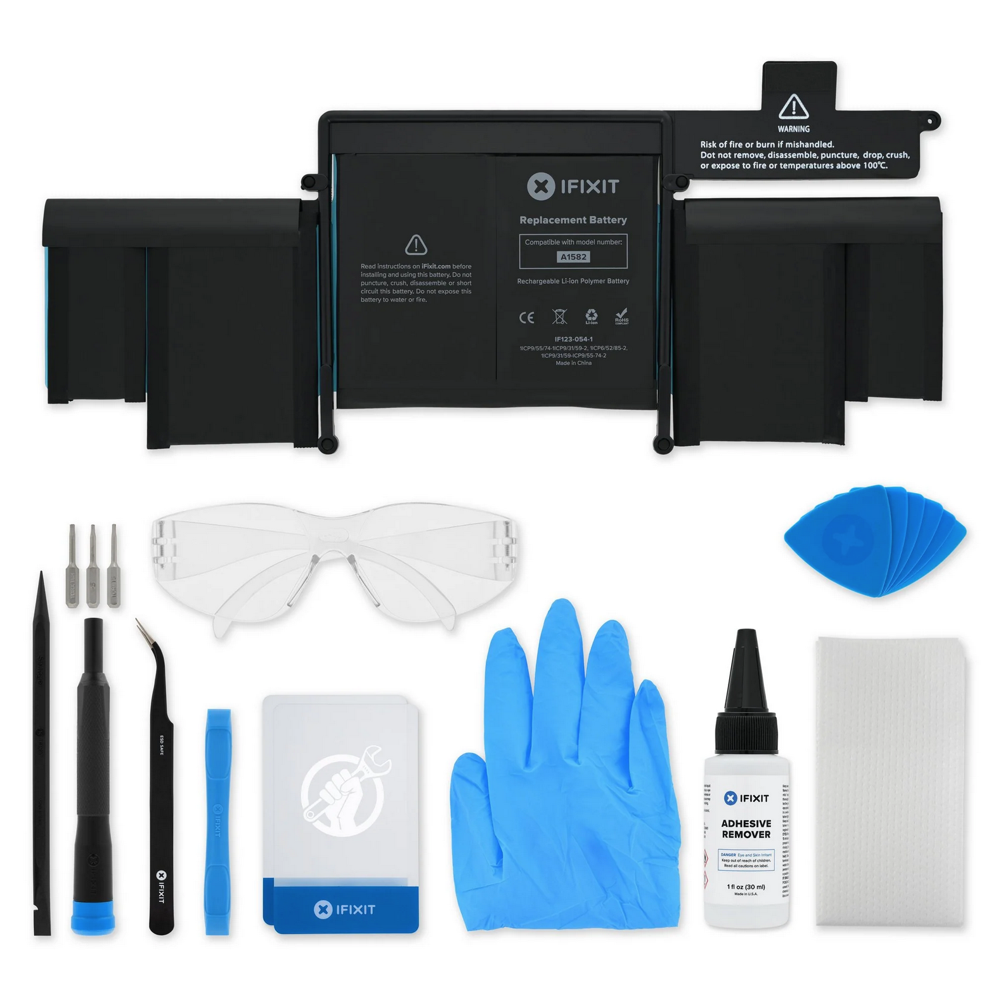

---

<!-- _header: "" -->
<!-- _footer: "" -->

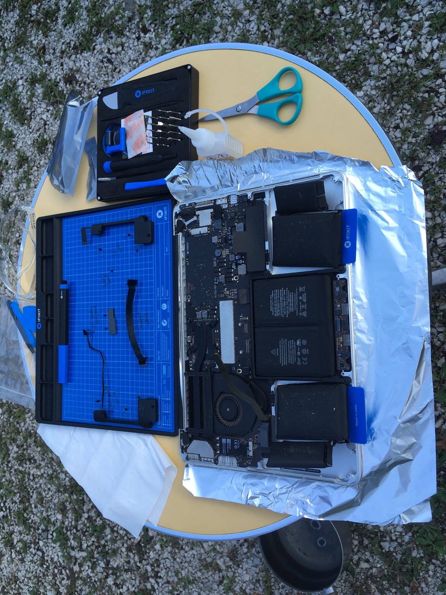

---

<!-- _header: "" -->
<!-- _footer: "" -->

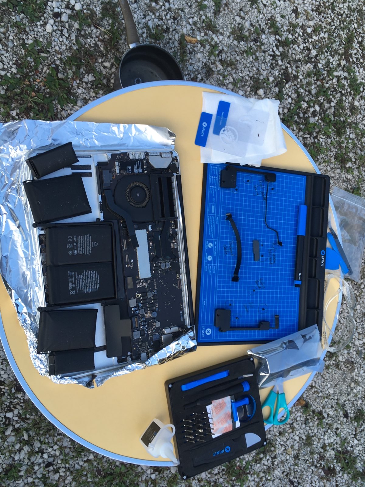

---

<!-- _header: "" -->
<!-- _footer: "" -->

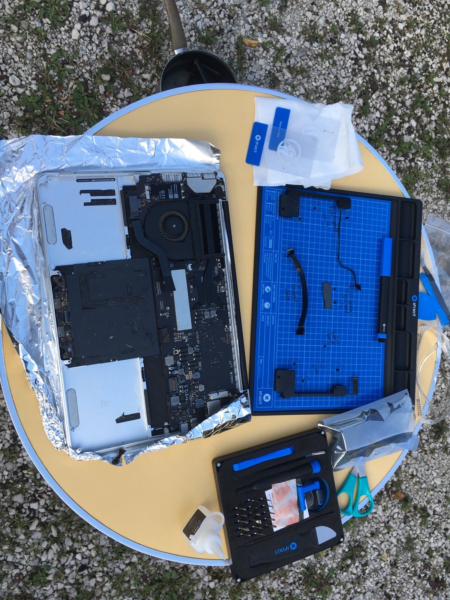

---

## 🥵 Keyboard Replacement

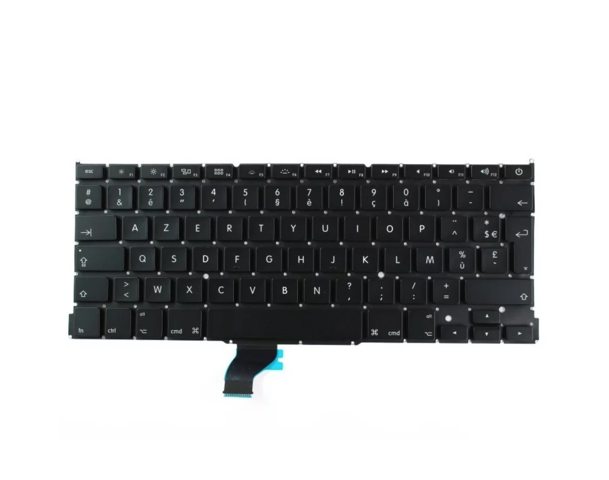

---

<!-- _header: "" -->
<!-- _footer: "" -->

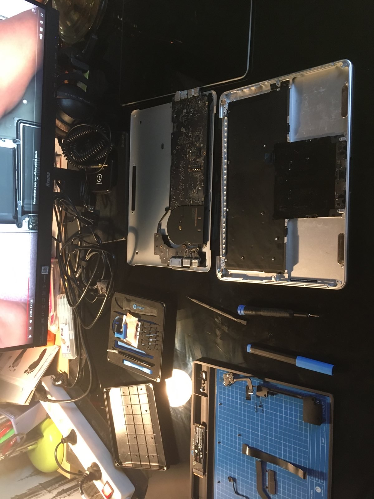

---

## Wait?!

---

## Wait?!

You need an extra Torx T3 screwdriver! 😱

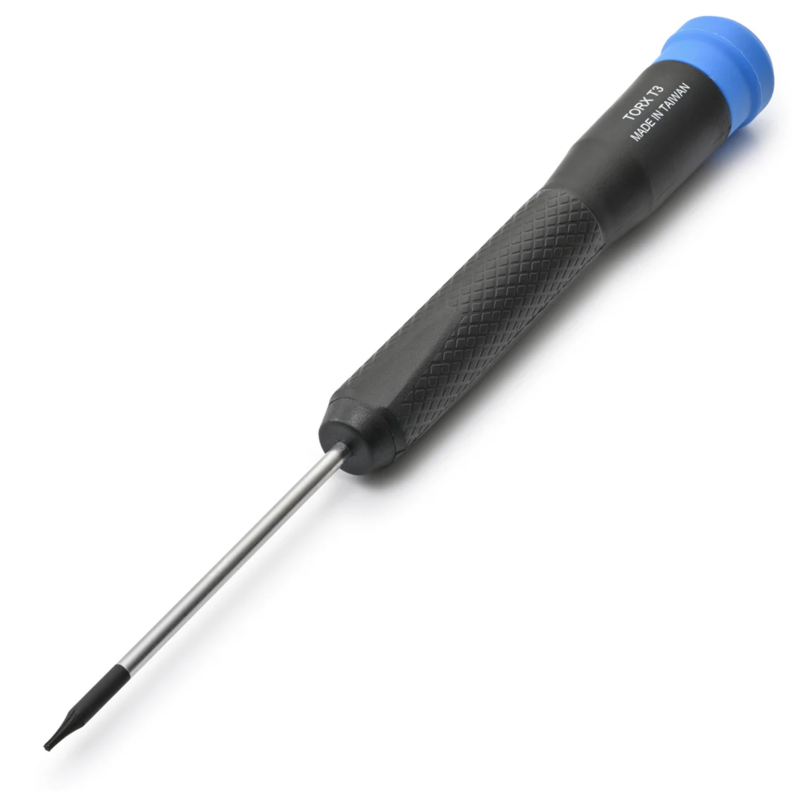

---

<!-- _header: "" -->
<!-- _footer: "" -->

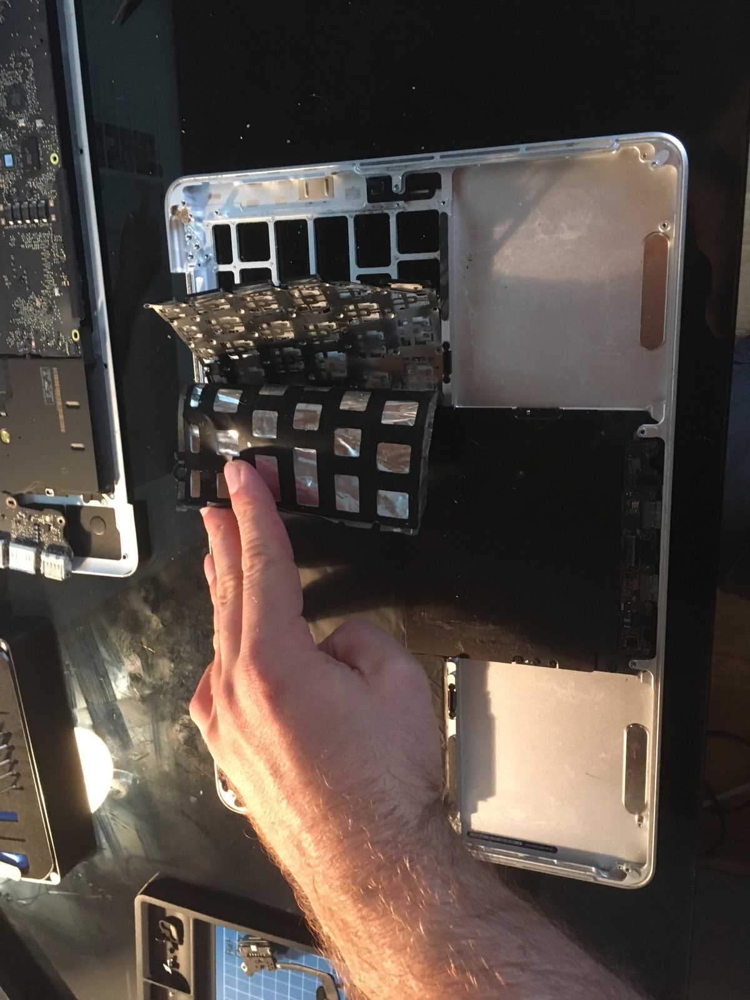

---

<!-- _header: "" -->
<!-- _footer: "" -->

---

## One last thing...

---

## One last thing...

You need teeny tiny keyboard screws in-place of rivets! 🤬

---

## Repair Cost Breakdown

- New thermal paste: 5€
- New battery: 80€
- New keyboard: 30€
- Tools: 50€
- Time: ~5-10 hours

---

## Software Upgrade

OpenCore Legacy Patcher project

✨ Beyond MacOS 12 Monterey!

---

## Why self-inflict all this pain?

- Right to repair
- Extend the life of electronics
- Better know our gear
- Prove something to myself?

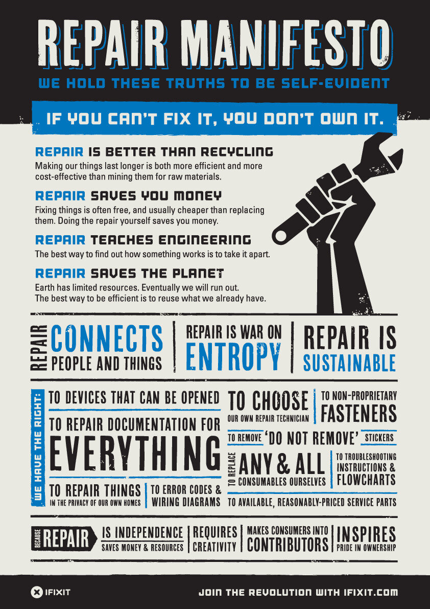

---

## Thanks Apple

See you in a few years 😉

---

### References

- [iFixit right to repair manifesto](https://www.ifixit.com/News/35268/how-to-get-involved-with-right-to-repair)
- [iFixit battery replacement guide](https://www.ifixit.com/Guide/MacBook+Pro+13-Inch+Retina+Display+Early+2015+Battery+Replacement/45137)
- [YouTube tutorial for keyboard replacement](https://www.youtube.com/watch?v=qVkEZvw9-JE)
- [OpenCore Legacy Patcher](https://dortania.github.io/OpenCore-Legacy-Patcher/)
