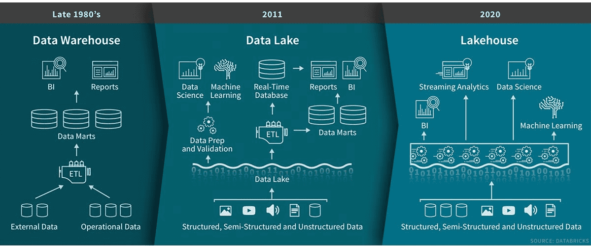
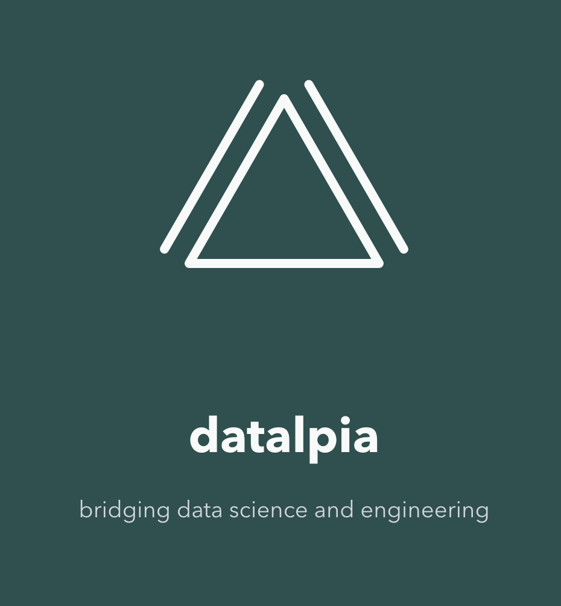

<!-- _header: "" -->
<!-- _footer: "" -->
<!-- _paginate: false -->


# Travailler avec des Data Lakehouses en Python, sans Spark

> **Romain Clement**

> PyConFR Lyon 2025
> 1er novembre 2025

<!--
Avez-vous déjà démarré un cluster Spark juste pour mettre à jour trois lignes dans une table Delta ?

Bonjour à tous, je suis Romain. Pour les 30 prochaines minutes, nous allons plonger dans les workflows Data Lakehouse avec du Python uniquement, sans Spark.

Avant de démarrer, qui est familier avec le concept de Data Lakehouse ?
-->

---

## 💡 Qu'est-ce qu'un Data Lakehouse ?



<!--
Voici un diagramme récapitulatif par Databricks présentant l'évolution dans le temps de l'architecture d'analytique de données :

- depuis les data warehouses des années 80,
- jusqu'à l'émergence des data lakes dans les années 2010 avec les cas d'usage de machine learning en tête (besoin d'accès au niveau des fichiers),
- jusqu'à l'unification du data lakehouse dans l'ère 2020.
-->

---


## 💡 Qu'est-ce qu'un Data Lakehouse ?

**Pont entre Data Lakes et Data Warehouses**

✅ Flexibilité des Data Lakes
✅ Gouvernance des Data Warehouses
✅ Séparation du stockage et calcul
✅ Open Table Formats : Delta, Iceberg, Hudi, DuckLake

*Popularisé par Databricks & Snowflake*

<!--
Alors, qu'est-ce qu'un Data Lakehouse exactement, et dans quel cadre cela est utile ?

Avez-vous déjà eu du mal avec des lacs de données qui deviennent des marécages ?

Le concept de lakehouse comble ce fossé entre Data Lakes et Data Warehouses en :
- Conservant la flexibilité des data lakes
- Apportant les garanties de cohérence des data warehouses
- Découplant le stockage et le calcul pour l'optimisation des coûts, avec notamment du stockage distribué dans le cloud comme S3 ou ADLS

Les formats de data lakehouse sont tous des formats de tables dits ouverts : on les dénomment "Open Table Formats". Vous avez probablement entendu parler de Delta Lake de Databricks, Iceberg de Netflix, Hudi d'Uber ou même le dernier en date, DuckLake de DuckDB.
-->

---

## ⚙️ Fonctionnalités Data Lakehouse

**Performance & Coût**
- Stockage et calcul scalables
- Dimensionnement indépendant

**Fiabilité des données**
- Transactions ACID
- Application et évolution de schéma

**Flexibilité opérationnelle**
- Time-travel
- Snapshots / branching

<!--
Alors, qu'obtenez-vous réellement avec un lakehouse ? Laissez-moi mettre en avant les fonctionnalités clés qui résolvent ces problèmes de marécages de données en combinant le meilleur des deux mondes : data lakes et data warehouses.

Premièrement, vous obtenez les avantages de performance et de coût : des ressources de stockage et calcul que vous pouvez dimensionner indépendamment, plus besoin de payer pour des clusters de calcul inactifs.

Deuxièmement, vous obtenez la fiabilité des données : grâce aux transactions ACID les données ne sont plus corrompues lors des jobs échoués, et grâce à l'application de schéma pré-défini vos données restent cohérentes.

Et enfin, vous obtenez la flexibilité opérationnelle : le time-travel pour le débogage et l'audit, les snapshots pour l'expérimentation. Des fonctionnalités qui facilitent grandement votre vie en tant que data engineer ou data scientist.

Ce ne sont pas que des mots à la mode : ce sont des solutions pratiques à de vrais problèmes auxquels nous sommes confrontés régulièrement.
-->

---

## 🗂️ Exemple de format de données (Delta)

```
table_name
|-- _delta_log
|   |-- 00000000000000000000.json
|   |-- 00000000000000000001.json
|   |-- 00000000000000000002.json
|-- partition=1
    |-- part-00001-1a31a393-6db6-4d1a-bf4e-81ea061ff8cd-c000.snappy.parquet
|-- partition=2
    |-- part-00001-5af77102-9207-4c89-aaf6-37e1f815ec26-c000.snappy.parquet
    |-- part-00001-b11bab55-43d0-4d05-ae88-5b9481ae57db-c000.snappy.parquet
```

**Stockage = Fichiers Parquet + Journal transactionnel**

<!--
Laissez-moi vous montrer à quoi ressemble réellement un format Data Lakehouse sous le capot : prenons Delta Lake comme exemple.

Vos données sont stockées dans des fichiers Parquet : pensez "CSV mais en colonnes, compressé, et avec des types de données."

La magie réside dans le répertoire _delta_log : des fichiers JSON qui tracent chaque changement.
Ce journal transactionnel indique aux moteurs de requête exactement quels fichiers Parquet lire pour une version donnée.

Cette simple combinaison vous donne les transactions ACID, le time-travel, et toutes ces fonctionnalités dont nous venons d'évoquer.

Pas d'infrastructure complexe : juste des fichiers sur un stockage avec lesquels n'importe quel moteur de requête peut travailler.
-->

---


## 🔥 Pourquoi (ne pas utiliser) Spark ?

Conçu pour les traitements de données massives (>= 1 To)

Complexité d'infrastructure de cluster de calcul

Gestion de JVM

Développement local complexe

Qu'en est-il des données à petite/moyenne échelle ?

<!--
Maintenant, voici le problème : Spark est une technologie incroyable, c'est le système distribué de facto pour les traitements de données depuis 10 ans, mais cela a un coût.

Spark est conçu pour des charges massives : nous parlons de centaines de gigaoctets, de téraoctets et au-delà. Mais à quelle fréquence traitez-vous réellement autant de données ?

Le plus souvent, vous gérez la configuration de cluster de calcul, le tuning de la JVM, et un développement local complexe juste pour mettre à jour quelques centaines de lignes.

Et le pire : même lorsque votre stockage est important, votre requête réelle ne touche peut-être qu'un petit sous-ensemble de ces données.

Alors pourquoi ne pas commencer simplement ? Obtenez les avantages de stockage des formats lakehouse sans la complexité opérationnelle.

Vous pourrez toujours migrer sur Spark plus tard quand vous avez réellement un besoin de mise à l'échelle.
-->

---

## 🐍 Démarrer en Python

| Format   | Librairie native | Polars | DuckDB |
| -------- | ---------------- | ------ | ------ |
| Delta    | `deltalake`      | ✅      | ⚠️      |
| Iceberg  | `pyiceberg`      | ✅      | ⚠️      |
| Hudi     | `hudi`           | -      | -      |
| DuckLake | -                | -      | ✅      |

_Note : état actuel en octobre 2025_

<!--
Alors, comment démarrer concrètement ? L'écosystème Python a explosé avec le support lakehouse ces dernières années.

Pour chaque format, vous avez le choix : gestion de tables bas-niveau avec des librairies comme `deltalake` et `pyiceberg`, ou opérations plus haut niveau sur des dataframe avec `polars`.

Mais une autre approche émergente se révèle tout aussi excitante : `duckdb` a un support partiel pour Delta et Iceberg, et bien sûr un support complet pour DuckLake. Cependant, comme nous le verrons, vous pouvez le faire fonctionner avec n'importe quel format de table avec une astuce simple. Des performances simple-noeud qui rivalisent avec les systèmes distribués, et il peut lire tous les formats lakehouse majeurs.

Nous nous concentrerons sur Delta Lake aujourd'hui car c'est le plus facile pour démarrer, mais tout ce que je vous montre peut être adapté aux autres formats.

Le point clé ici ? En 2025, il n'y a aucune raison pour que Spark soit votre choix par défaut pour les traitements de données à base de lakehouse en Python.
-->

---


## Exemple Delta avec `deltalake`

**Démonstration pratique**

✅ Créer des tables & écrire des données
✅ Opérations de fusion
✅ Historique et time-travel
✅ Python pur, sans clusters

<!--
Passons maintenant à la pratique avec un exemple simple utilisant des données météo.

Nous allons parcourir les bases : créer des tables, écrire des données, effectuer des fusions, et explorer les fonctionnalités de time-travel de Delta.

Tout s'exécute localement avec juste Python - aucune configuration de cluster nécessaire.
-->

---

### Créer une table

```python
>>> from deltalake import DeltaTable, Field, Schema
>>>
>>> weather_table_uri = ".datasets/weather"
>>> table = DeltaTable.create(
        weather_table_uri,
        storage_options=None,
        schema=Schema(
            [
                Field("time", "timestamp"),
                Field("city", "string"),
                Field("temperature", "float"),
            ]
        ),
        name="Weather",
        description="Forecast weather data",
    )
```

<!--
Commençons simplement : créer une table Delta consiste juste à définir un schéma et pointer vers un répertoire.

Remarquez que nous utilisons des types de données appropriés : timestamp pour les données de temps, string pour les données catégorielles, et float pour les données quantitatives (mesures).

La librairie deltalake gère tous les détails du protocole Delta Lake pour nous.
 -->

---

### Créer une table

```bash
.datasets/weather
└── _delta_log
    └── 00000000000000000000.json
```

_Répertoire de table avec journal transactionnel initial_

<!--
Voici ce qui est créé : juste un répertoire avec un dossier _delta_log contenant le journal transactionnel.

Ce premier fichier JSON contient les données transactionnelles de la version initiale de la table, traçant l'historique de notre table.

Aucun fichier de données pour l'instant puisque nous n'avons encore rien écrit.
-->

---

### Inspecter les métadonnées de la table

```python
>>> str(table.metadata())
Metadata(
  id: '830c7cf1-f8f8-4c59-b3f7-369d93d914ca',
  name: Weather,
  description: 'Forecast weather data',
  partition_columns: [],
  created_time: 1758725496285,
  configuration: {}
)
```

<!--
Chaque table Delta possède des métadonnées associées. Remarquez l'ID unique autogénéré et l'horodatage de création.

Les colonnes de partition vides signifient que nous ne partitionnons pas encore nos données, ce qui convient parfaitement pour les petits jeux de données.
-->

---

### Inspecter le schéma de la table

```python
>>> table.schema().to_arrow()
arro3.core.Schema
------------
time: Timestamp(Microsecond, Some("UTC"))
city: Utf8
temperature: Float32
```

<!--
Le schéma de la table est compatible avec le format Arrow, ce qui nous donne une large compatibilité avec l'écosystème. Remarquez comment nos types Python sont mappés aux types Arrow.
 -->

---

### Écrire dans une table

Ajoutons d'abord des données :

```python
>>> import pandas as pd
>>> from deltalake import write_deltalake
>>>
>>> weather_df_1 = pd.DataFrame(
  [
    {"time": "2025-09-30T12:00:00Z", "city": "Paris", "temperature": 10.0},
    {"time": "2025-09-30T13:00:00Z", "city": "Paris", "temperature": 11.0},
    {"time": "2025-09-30T14:00:00Z", "city": "Paris", "temperature": 12.0},
  ]
)
>>> write_deltalake(weather_table_uri, weather_df_1, mode="append", storage_options=None)
```

<!--
Écrire des données dans une table est simple : créez un DataFrame pandas (ou toute autre librairie DataFrame) et utilisez la fonction utilitaire write_deltalake.

Le mode='append' garantit que nous n'écrasons pas les données existantes. Nous pouvons également utiliser mode='overwrite' pour remplacer tout le contenu de la table.

En coulisse, cela crée des fichiers Parquet et met à jour le journal transactionnel de manière atomique.
-->

---

### Écrire dans une table

```bash
.datasets/weather
├── _delta_log
│   ├── 00000000000000000000.json
│   └── 00000000000000000001.json
└── part-00001-4f6cdffe-981b-4157-b19b-7fba04b1f7a6-c000.snappy.parquet
```

_Nouvelle transaction et un fichier Parquet_

<!--
Nous voyons maintenant la puissance de Delta : une nouvelle entrée dans le journal transactionnel et un fichier Parquet contenant nos données.

Chaque opération d'écriture est tracée, nous donnant une piste d'audit complète et permettant le time-travel.
-->

---

### Écrire dans une table

Effectuons un upsert de données :

```python
>>> weather_df_2 = pd.DataFrame(
  [
    {"time": "2025-09-30T13:00:00Z", "city": "Paris", "temperature": 12.0},
    {"time": "2025-09-30T14:00:00Z", "city": "Paris", "temperature": 13.0},
    {"time": "2025-09-30T15:00:00Z", "city": "Paris", "temperature": 14.0},
  ]
)
>>> table = DeltaTable(weather_table_uri, storage_options=None)
>>> (
      table.merge(
        source=weather_df_2,
        source_alias="source",
        target_alias="target",
        predicate="target.time = source.time and target.city = source.city",
      )
      .when_matched_update(updates={"temperature": "source.temperature"})
      .when_not_matched_insert(
        updates={"time": "source.time", "city": "source.city", "temperature": "source.temperature"}
      )
      .execute()
    )
```

<!--
Voici une autre fonctionnalité puissante de Delta : l'opération de fusion (merge), permettant par exemple d'effectuer des opérations de déduplication ou d'upserts.

Ici, nous mettons à jour les prévisions de température existantes où time et city correspondent, et insérons les nouvelles. Cela serait complexe avec des fichiers Parquet bruts, mais Delta le gère élégamment.
-->

---

### Écrire dans une table

```bash
.datasets/weather
├── _delta_log
│   ├── 00000000000000000000.json
│   ├── 00000000000000000001.json
│   └── 00000000000000000002.json
├── part-00001-4f6cdffe-981b-4157-b19b-7fba04b1f7a6-c000.snappy.parquet
├── part-00001-d7036469-24e9-4362-9871-9a3641365b29-c000.snappy.parquet
└── part-00001-f06d4ec1-4545-4844-976c-c80d31bba1dd-c000.snappy.parquet
```

_Nouvelle transaction et deux fichiers Parquet_

<!--
Après la fusion, nous avons trois fichiers Parquet et trois entrées dans le journal transactionnel. Nous allons voir dans un instant pourquoi deux nouveaux fichiers au lieu d'un seul ont été créés.

Cela peut sembler beaucoup de fichiers, mais le planificateur de requêtes de Delta sait exactement quels fichiers contiennent quelles données pour des requêtes efficaces.
-->

---

```bash
.datasets/weather/part-00001-4f6cdffe-981b-4157-b19b-7fba04b1f7a6-c000.snappy.parquet
┌──────────────────────────┬─────────┬────────────────┐
│           time           │  city   │  temperature   │
│ timestamp with time zone │ varchar │     float      │
├──────────────────────────┼─────────┼────────────────┼
│ 2025-09-30 12:00:00+00   │ Paris   │           10.0 │
│ 2025-09-30 13:00:00+00   │ Paris   │           11.0 │
│ 2025-09-30 14:00:00+00   │ Paris   │           12.0 │
└──────────────────────────┴─────────┴────────────────┘

.datasets/weather/part-00001-d7036469-24e9-4362-9871-9a3641365b29-c000.snappy.parquet
┌──────────────────────────┬─────────┬────────────────┐
│           time           │  city   │  temperature   │
│ timestamp with time zone │ varchar │     float      │
├──────────────────────────┼─────────┼────────────────┤
│ 2025-09-30 13:00:00+00   │ Paris   │           12.0 │
│ 2025-09-30 14:00:00+00   │ Paris   │           13.0 │
│ 2025-09-30 12:00:00+00   │ Paris   │           10.0 │
└──────────────────────────┴─────────┴────────────────┘

.datasets/weather/part-00001-f06d4ec1-4545-4844-976c-c80d31bba1dd-c000.snappy.parquet
┌──────────────────────────┬─────────┬────────────────┐
│           time           │  city   │  temperature   │
│ timestamp with time zone │ varchar │     float      │
├──────────────────────────┼─────────┼────────────────┤
│ 2025-09-30 15:00:00+00   │ Paris   │      14.0      │
└──────────────────────────┴─────────┴────────────────┘
```

<!--
Jetons un oeil aux fichiers Parquet pour comprendre ce qui s'est passé.

Le premier fichier Parquet est l'insertion de données initiale avec le mode 'append'.

Ensuite, l'opération de fusion a créé deux nouveaux fichiers plutôt que de modifier l'existant :
- Le premier contient les lignes mises à jour
- Le second contient les lignes insérées.

C'est la clé des garanties ACID de Delta. Les fichiers Parquet immuables signifient que les lecteurs concurrents ne sont jamais bloqués.
-->

---

### Lire une table

```python
>>> table = DeltaTable(weather_table_uri, storage_options=None)
>>> table.version()
2
>>> table.to_pandas()
                       time   city     temperature
0 2025-09-30 15:00:00+00:00  Paris            14.0
1 2025-09-30 13:00:00+00:00  Paris            12.0
2 2025-09-30 14:00:00+00:00  Paris            13.0
3 2025-09-30 12:00:00+00:00  Paris            10.0
```

<!--
Lire une table est plutôt simple : Delta lit automatiquement tous les fichiers Parquet pertinents et vous donne la vue la plus récente. Remarquez que nous sommes à la version 2 maintenant, et les données reflètent notre opération de fusion avec des températures mises à jour.

L'objet DeltaTable permet de spécifier des conditions de filtrage et des noms de colonnes pour éviter de lire tous les fichiers Parquet (c'est ce qu'on appelle les optimisations de file skipping, predicate pushdown et column pruning).
-->

---

### Récupérer l'historique de la table

Version 0 (création de la table) :

```python
>>> table.history()
[
  {
    'timestamp': 1758720246806,
    'operation': 'CREATE TABLE',
    'operationParameters': {
      'protocol': '{"minReaderVersion":1,"minWriterVersion":2}',
      'mode': 'ErrorIfExists',
      'location': 'file:///.../.datasets/weather',
      'metadata': '{"configuration":{},"createdTime":1758720246797...}'
    },
    'engineInfo': 'delta-rs:py-1.1.0',
    'clientVersion': 'delta-rs.py-1.1.0',
    'version': 0
  }
  ...
]
```

<!--
Pouvoir récupérer l'historique de la table est précieux pour le débogage et l'audit des changements dans le temps.

Chaque opération est tracée avec des métriques : combien de fichiers ont été impactés, temps d'exécution, lignes affectées. Ces métadonnées opérationnelles nécessiteraient un effort d'ingénierie significatif pour être implémentées à partir de zéro.

Ceci est la version initiale de la table (version 0) avec les métadonnées de création de table.
-->

---

### Récupérer l'historique de la table

Version 1 (ajout de données) :
```python
>>> table.history()
[
  ...
  {
    'timestamp': 1758720703062,
    'operation': 'WRITE',
    'operationParameters': {'mode': 'Append'},
    'engineInfo': 'delta-rs:py-1.1.0',
    'clientVersion': 'delta-rs.py-1.1.0',
    'operationMetrics': {
      'execution_time_ms': 142,
      'num_added_files': 1,
      'num_added_rows': 3,
      'num_partitions': 0,
      'num_removed_files': 0
    },
    'version': 1
  }
  ...
]
```

<!--
Ceci est la deuxième version de la table (version 1) avec l'opération d'ajout de données.
 -->

---

### Récupérer l'historique de la table

Version 2 (fusion de données) :

```python
>>> table.history()
[
  ...
  {
    'timestamp': 1758726633699,
    'operation': 'MERGE',
    'operationParameters': {...},
    'readVersion': 1,
    'engineInfo': 'delta-rs:py-1.1.0',
    'operationMetrics': {
      'execution_time_ms': 45,
      'num_output_rows': 4,
      'num_source_rows': 3,
      'num_target_files_added': 2,
      'num_target_files_removed': 1,
      'num_target_files_scanned': 1,
      'num_target_files_skipped_during_scan': 0,
      'num_target_rows_copied': 1,
      'num_target_rows_deleted': 0,
      'num_target_rows_inserted': 1,
      'num_target_rows_updated': 2,
      'rewrite_time_ms': 10,
      'scan_time_ms': 0
    },
    'clientVersion': 'delta-rs.py-1.1.0',
    'version': 2
  }
]
```

<!--
Ceci est la troisième version de la table (version 2) avec l'opération de fusion de données.
 -->

---

### Time-travel

```python
>>> table.load_as_version(0)
>>> table.to_pandas()
Empty DataFrame
Columns: [time, city, temperature]
Index: []

>>> table.load_as_version(1)
>>> table.to_pandas()
                       time   city     temperature
0 2025-09-30 12:00:00+00:00  Paris            10.0
1 2025-09-30 13:00:00+00:00  Paris            11.0
2 2025-09-30 14:00:00+00:00  Paris            12.0

>>> table.load_as_version(2)
>>> table.to_pandas()
                       time   city     temperature
0 2025-09-30 15:00:00+00:00  Paris            14.0
1 2025-09-30 13:00:00+00:00  Paris            12.0
2 2025-09-30 14:00:00+00:00  Paris            13.0
3 2025-09-30 12:00:00+00:00  Paris            10.0
```

<!--
Le time-travel est l'une des fonctionnalités phares de Delta. Chargez n'importe quelle version précédente pour le débogage, la récupération de données, ou l'analyse reproductible.

Comme attendu, la version 0 est vide (juste après la création de la table), la version 1 contient nos données initiales, la version 2 inclut la fusion. C'est pourquoi Delta conserve tous ces journaux transactionnels.
-->

---


## Exemple Delta avec `duckdb`

✅ Scanner une table Delta
✅ Interopérabilité avec `deltalake`

<!--
Maintenant que nous avons exploré comment démarrer avec le package Python deltalake, passons à DuckDB.

DuckDB apporte la sémantique SQL à vos workflows lakehouse Python.

Requêtes rapides grâce au multithreading efficace, configuration simple, et support natif Delta Lake : le complément parfait à deltalake pour l'exploration et l'analyse de données.
-->

---

### Scanner une table Delta

```sql
$ from delta_scan('.datasets/weather');
┌──────────────────────────┬─────────┬────────────────┐
│           time           │  city   │  temperature   │
│ timestamp with time zone │ varchar │     float      │
├──────────────────────────┼─────────┼────────────────┤
│ 2025-09-30 15:00:00+00   │ Paris   │           14.0 │
│ 2025-09-30 13:00:00+00   │ Paris   │           12.0 │
│ 2025-09-30 14:00:00+00   │ Paris   │           13.0 │
│ 2025-09-30 12:00:00+00   │ Paris   │           10.0 │
└──────────────────────────┴─────────┴────────────────┘
```

<!--
C'est là que DuckDB brille : scan direct de table Delta sans aucune configuration.

Pointez simplement DuckDB vers votre répertoire de table Delta et interrogez-la comme n'importe quelle base de données.

Remarquez que nous obtenons les mêmes données que nous avons créées précédemment, mais maintenant nous pouvons utiliser simplement du SQL. Pas d'ETL, pas de déplacement de données, juste de la puissance analytique pure.

À noter que DuckDB a encore de nombreuses restrictions concernant les formats Lakehouse en octobre 2025 :
- Seulement des opérations de lecture, pas d'écriture (Iceberg vient d'arriver)
- Les opérations de time-travel sont encore en développement
-->

---

### Interopérabilité avec `deltalake`

```python
>>> import duckdb
>>>
>>> weather_ds = table.to_pyarrow_dataset()
>>> conn = duckdb.connect()
>>> conn.register("weather", weather_ds)
>>> conn.execute("select * from weather").df()
                       time   city     temperature
0 2025-09-30 15:00:00+00:00  Paris            14.0
1 2025-09-30 13:00:00+00:00  Paris            12.0
2 2025-09-30 14:00:00+00:00  Paris            13.0
3 2025-09-30 12:00:00+00:00  Paris            10.0
```

<!--
Mais la vraie magie réside dans l'interopérabilité. Prenez votre table Delta depuis deltalake, convertissez-la en dataset PyArrow, et enregistrez-la dans DuckDB.

Et vous pouvez également faire l'inverse : effectuez des requêtes complexes sur des tables Delta dans DuckDB, exportez les résultats sous forme de structure Arrow Record Batches, et streamez les résultats pour les écrire avec la fonction write_deltalake ! De cette façon, vous pouvez effectuer des pipelines de données out-of-core pour des jeux de données plus volumineux.

Maintenant vous avez le meilleur des deux mondes : les opérations ACID de Delta pour les écritures, l'analytique ultra-rapide de DuckDB pour les lectures. C'est la promesse du lakehouse : un jeu de données, plusieurs moteurs, le tout sans la complexité de Spark.
-->

---

## 🗼 Présentation de `laketower`

Application Python utilitaire local-first (CLI + Web)

Gestion simple des tables lakehouse

Licence OSS Apache-2

Pour commencer :
- `uvx laketower`
- https://github.com/datalpia/laketower

<!--
Dernier outil Python pour les formats lakehouse : laissez-moi vous présenter un projet sur lequel je travaille depuis quelques mois, "Laketower". Je développe celui-ci pour répondre à mes propres besoins, car la plupart des applications de données haut niveau ne supportent pas les formats lakehouse.

C'est une application utilitaire Python open-source sous licence Apache-2, fournissant une interface en ligne de commande et une interface web pour explorer et gérer les tables lakehouse. Elle est local-first, compatible avec les tables stockées localement et à distance. Elle ne supporte que Delta Lake pour l'instant, mais d'autres formats comme Iceberg et DuckLake viendront.

La manière la plus simple de commencer à l'utiliser : "uvx laketower" (vous pouvez bien sûr faire "pip install laketower")
 -->

---

## 🗼 Présentation de `laketower`


---

## 🗼 Présentation de `laketower`


---

## 🗼 Présentation de `laketower`


---

## 🗼 Présentation de `laketower`


---

## 🗼 Présentation de `laketower`


---

## 🚀 À retenir

**Commencez simple, montez en puissance quand nécessaire**

✅ Bénéfices du lakehouse sans la complexité Spark
✅ Écosystème Python riche et disponible aujourd'hui
✅ Prêt pour la production pour les charges petites et moyennes

**Prochaines étapes :** Choisissez un format, choisissez une librairie, construisez quelque chose !

<!--
Voici donc ce qu'il faut retenir : vous n'avez pas besoin de sur-complexifier votre stack de données.

Commencez avec les librairies lakehouse Python pour vos charges de travail petites à moyennes. Obtenez tous les bénéfices : transactions ACID, time-travel, application de schéma, sans le fardeau opérationnel.

L'écosystème est mature, les outils sont prêts, et vous pouvez commencer aujourd'hui.

Et quand vous avez réellement besoin de traitement distribué massif ? C'est à ce moment que vous passez à Spark. Mais commencez simple.

Votre moi du futur vous remerciera de ne pas avoir lancé de clusters de calcul pour mettre à jour trois lignes.
-->

---

## Romain CLEMENT

Consultant indepedent, **Datalpia**



Co-organisateur Meetup Python Grenoble

🌐 [datalpia.com](https://datalpia.com)
🌐 [romain-clement.net](https://romain-clement.net)
🔗 [linkedin.com/in/romainclement](https://www.linkedin.com/in/romainclement)

---

# 🙋 Questions ?

Merci ! Discutons !

<!--
Questions anticipées :

"Comment se connecter aux tables Delta sur Databricks ?"
  - `deltalake` fournit maintenant une intégration native de l'API Unity Catalog pour obtenir l'URI de stockage objet et le jeton d'accès temporaire
  - mais nécessite des permissions spéciales à activer dans l'espace de travail Databricks concernant le "credential vending"

"Quel est le seuil à partir duquel je dois passer à Spark ?"
  - Une bonne règle empirique serait 100Go sur un seul noeud
  - Certaines études sur internet montrent que DuckDB et Polars peuvent encore gérer cette plage sur une machine puissante
  - Mais si les données croissent continuellement et que vous devez vraiment en traiter une partie ou la totalité, Spark pourrait être plus sage / plus pérenne dans ce cas

"Est-ce prêt pour la production ?"
  - "Ça dépend" de vos exigences
  - Librairies bas niveau : oui, elles sont matures, supportent la plupart des opérations mais ne sont pas encore aussi complètes que leurs homologues Spark (par exemple `deltalake` ne supporte pas les "deletion vectors" en septembre 2025)
  - DuckDB : très bonnes performances, mais ne supporte que les opérations de lecture pour Delta (Iceberg supporte l'écriture depuis octobre 2025), la fonctionnalité de time-travel est partiellement implémentée aujourd'hui

"La mise à jour des tables crée beaucoup de fichiers Parquet, pas efficace pour les moteurs de requête. Comment corriger ?"
  - Utilisez l'optimisation "data compaction"
  - Elle ne fera que marquer les fichiers de données comme "supprimés" dans le journal transactionnel mais ne les supprime pas physiquement
  - Pour supprimer ces fichiers "marqués pour suppression", vous avez besoin de l'opération "data vaccuming"

"Qu'en est-il de la rétention des données ?"
  - Utilisez l'opération "data vaccuming" pour supprimer les anciens fichiers au-delà d'une période de rétention donnée et ceux marqués pour suppression (après une opération d'optimisation par exemple)

"Pourquoi créer beaucoup de fichiers Parquet au lieu de les mettre à jour ?"
  - Parquet est un format de fichier immuable

"Peut-on avoir des clés primaires ?"
  - Contraintes disponibles : NOT NULL, CHECK

"Qu'en est-il du traitement out-of-core mais avec des tailles de données moyennes ?"
  - Vous pouvez lire et écrire des données par lots avec deltalake et duckdb
  - Cela nécessite généralement d'utiliser le format PyArrow Dataset entre les deux et ça fonctionne très bien

"Puis-je avoir accès au flux de changements de données dans une table ?"
  - Oui, en utilisant le Change Data Feed (CDF)
  - Il doit être activé à la création de la table en utilisant "delta.enableChangeDataFeed"

"Y a-t-il des benchmarks de performance comparant Spark vs Delta-rs ou DuckDB ?"
  - Je ne l'ai pas fait moi-même
  - Mais il y a une comparaison 2025 par Miles Cole disponible : https://milescole.dev/data-engineering/2025/06/30/Spark-v-DuckDb-v-Polars-v-Daft-Revisited.html
  - La conclusion est : à partir de 100GB à traiter, Spark est toujours roi, sinon utilisez Delta-rs, Polars et/ou DuckDB pour la réduction des coûts
-->

---

## 📚 References

- [Evolution to the Data Lakehouse](https://www.databricks.com/blog/2021/05/19/evolution-to-the-data-lakehouse.html)
- [Explaining the History of Data Lakehouse](https://dev.to/pkutaj/explaining-the-history-of-data-lakehouse-504a)
- [Understanding Open Table Formats](https://delta.io/blog/open-table-formats/)
- [Deltalake Python](https://delta-io.github.io/delta-rs/)
- [PyIceberg](https://py.iceberg.apache.org/)
- [Hudi Python/Rust](https://hudi.apache.org/docs/python-rust-quick-start-guide)
- [DuckLake](https://ducklake.select/)
- [DuckDB](https://duckdb.org)
