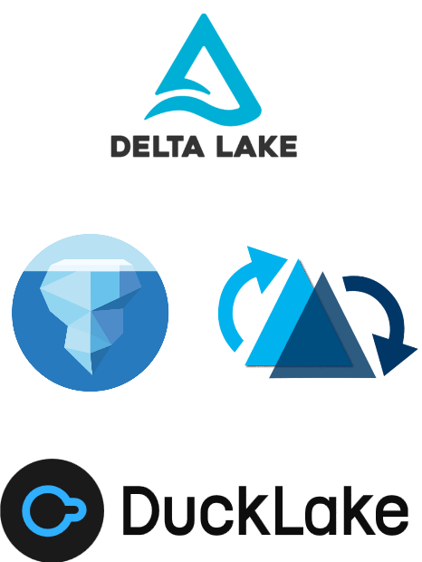
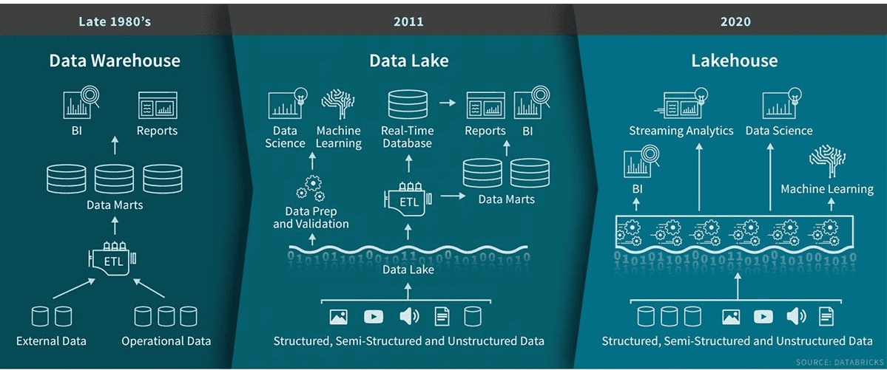

<!-- _header: "" -->
<!-- _footer: "" -->
<!-- _paginate: false -->


# You Don’t Need Spark for That: Pythonic Data Lakehouse Workflows

> **Romain Clement**

> PyData Paris 2025
> September 30th 2025

<!--
Have you ever spun up a Spark cluster just to update three rows in a Delta table?

Hi everyone, I'm Romain. For the next 30 minutes, we're diving into Data Lakehouse workflows: pure Python, no Spark required.
-->

---



## 💡 What's a Data Lakehouse?

**Bridge between Data Lakes & Data Warehouses**

✅ Flexibility of data lakes
✅ Governance of data warehouses
✅ Cost-effective storage + compute separation
✅ Open Table Formats: Delta, Iceberg, Hudi, DuckLake

*Popularized by Databricks & Snowflake*

<!--
So what exactly is a Data Lakehouse, and why should you care?

Have you ever struggled with data lakes becoming data swamps?

The lakehouse concept bridges that gap between Data Lakes and Data Warehouses by:
- Keeping the flexibility of data lakes
- Bringing consistency guarantees of data warehouses
- Decoupling storage and compute for cost optimization with cloud object storage like S3 or ADLS

And here's the best part: data lakehouse formats are all open table formats. You've probably heard of Delta Lake from Databricks, Iceberg from Netflix, Hudi from Uber or even the latest one in town, DuckLake from DuckDB.
-->

---

## 💡 What's a Data Lakehouse?



<!--
Here is a recap diagram from Databricks showcasing the evolution through time of data analytics architecture:
- from the data warehouses since the 80's,
- to the emergence of data lakes in the 2010's with machine learning use-cases in mind (need file level access),
- up to the data lakehouse unification in the 2020 era.
-->

---

## ⚙️ Data Lakehouse Features

<!--
TODO:
- diagram with parquet files + metadata on storage, query engine on compute (cloud, local)
-->

**Performance & Cost**
- Scalable storage + compute
- Independent scaling

**Data Reliability**
- ACID transactions
- Schema enforcement & evolution

**Operational Flexibility**
- Time-travel
- Snapshots / branching

<!--
So what do you actually get with a lakehouse? Let me highlight the key features that solve those data swamp problems by combining the best of both worlds from data lakes and warehouses.

First, you get the performance and cost benefits: scalable storage and compute that you can scale independently, no more paying for idle clusters.

Second, you get data reliability: ACID transactions mean no more corrupted data from failed jobs, plus schema enforcement so your data stays consistent.

And finally, you get operational flexibility: time-travel for debugging, snapshots for experimentation. Features that make your life as a data engineer or data scientist much easier.

These aren't just buzzwords: they're practical solutions to real problems you face every day.
-->

---

## 🗂️ Data format example (Delta)

```
table_name
|-- _delta_log
|   |-- 00000000000000000000.json
|   |-- 00000000000000000001.json
|   |-- 00000000000000000002.json
|-- partition=1
    |-- part-00001-1a31a393-6db6-4d1a-bf4e-81ea061ff8cd-c000.snappy.parquet
|-- partition=2
    |-- part-00001-5af77102-9207-4c89-aaf6-37e1f815ec26-c000.snappy.parquet
    |-- part-00001-b11bab55-43d0-4d05-ae88-5b9481ae57db-c000.snappy.parquet
```

**Storage = Parquet files + Transaction log**

<!--
Let me show you what a Data Lakehouse format actually looks like under the hood: we'll take Delta Lake as example.

You've got your data in Parquet files: think "CSV but columnar, compressed, and with data types."

The magic is in the _delta_log directory: JSON files that track every change.
This transaction log tells query engines exactly which Parquet files to read for any given version.

This simple combination gives you ACID transactions, time travel, and all those features we just discussed.

No complex infrastructure: just files on storage that any query engine can work with.

TODO (where/when?): illustrate/demo parquet files content and transaction log being created when performing table creation, data append, data merge, data overwrite, row deletion operations to better understand how it works
-->

---


## 🔥 Why (not) Spark?

Designed for big data workloads (>= 1TB)

Cluster infrastructure complexity

JVM overhead

Cumbersome local development

What about small/medium-scale data?

<!--
Now here's the thing: Spark is an amazing technology, it has been the de-facto distributed system for data workloads for the past 10 years, but it comes with a cost.

It's designed for massive workloads: we're talking terabytes and above. But how often are you actually processing that much data?

More often, you're dealing with cluster setup, JVM tuning, and complex local development just to update a few hundred rows.

And here's the kicker: even when your storage is big, your actual query might only touch a tiny subset of that data.

So why not start simple? Get the storage benefits of lakehouse formats without the operational complexity.

You can always scale up to Spark later when you actually need it.
-->

---

## 🐍 Getting started with Python

| Format   | Native Library | Polars | DuckDB |
| -------- | -------------- | ------ | ------ |
| Delta    | `deltalake`    | ✅      | ⚠️      |
| Iceberg  | `pyiceberg`    | ✅      | ⚠️      |
| Hudi     | `hudi`         | -      | -      |
| DuckLake | -              | -      | ✅      |

_Note: current state as of September 2025_

<!--
So how do you actually get started? The Python ecosystem has exploded with lakehouse support in the past few years.

For each format, you've got choices: low-level table management with libraries like `deltalake` and `pyiceberg`, or higher-level dataframe operations with `polars`.

But here's what's exciting: `duckdb` has partial support for Delta and Iceberg, and of course complete support for DuckLake. However, as we'll see, you can make it work with any table format with a simple trick. Single-node performance that rivals distributed systems, and it can read every major lakehouse format.

We'll focus on Delta Lake today since it's the easiest to get started with, but everything I show you can be adapted to the other formats.

The key point here? In 2025, there's no reason Spark has to be your default choice for lakehouse workloads in Python.
-->

---


## Example Delta with `deltalake`

**Hands-on walkthrough**

✅ Create tables & write data
✅ Merge operations
✅ History & time travel
✅ Pure Python, no clusters

<!--
Now let's get hands-on with a simple example using weather data.

We'll walk through the basics: creating tables, writing data, performing merges, and exploring Delta's time travel features.

Everything runs locally with just Python - no cluster setup required.
-->

---

### Creating a table

```python
>>> from deltalake import DeltaTable, Field, Schema
>>>
>>> weather_table_uri = ".datasets/weather"
>>> table = DeltaTable.create(
        weather_table_uri,
        storage_options=None,
        schema=Schema(
            [
                Field("time", "timestamp"),
                Field("city", "string"),
                Field("temperature", "float"),
            ]
        ),
        name="Weather",
        description="Forecast weather data",
    )
```

<!--
Let's start simple: creating a Delta table is just defining a schema and pointing to a directory.

Notice we're using proper data types: timestamp for time series data, string for categorical data, and float for measurements.

The deltalake library handles all the Delta Lake protocol details for us.
 -->

---

### Creating a table

```bash
.datasets/weather
└── _delta_log
    └── 00000000000000000000.json
```

_Table directory with initial transaction log_

<!--
This is what gets created: just a directory with a _delta_log folder containing the transaction log.

That first JSON file is the transaction data for the initial table version, tracking our table's history.

No data files yet since we haven't written anything.
-->

---

### Inspecting table metadata

```python
>>> str(table.metadata())
Metadata(
  id: '830c7cf1-f8f8-4c59-b3f7-369d93d914ca',
  name: Weather,
  description: 'Forecast weather data',
  partition_columns: [],
  created_time: 1758725496285,
  configuration: {}
)
```

<!--
Every Delta table has associated metadata. Notice the autogenerated unique ID and creation timestamp.

The empty partition columns means we're not partitioning our data yet, which is fine for small datasets.
-->

---

### Inspecting table schema

```python
>>> table.schema().to_arrow()
arro3.core.Schema
------------
time: Timestamp(Microsecond, Some("UTC"))
city: Utf8
temperature: Float32
```

<!--
The table schema is compatible with Arrow format, which gives us broad ecosystem compatibility. Notice how our Python types map to Arrow types.
 -->

---

### Writing to a table

Append some data first:

```python
>>> import pandas as pd
>>> from deltalake import write_deltalake
>>>
>>> weather_df_1 = pd.DataFrame(
  [
    {"time": "2025-09-30T12:00:00Z", "city": "Paris", "temperature": 10.0},
    {"time": "2025-09-30T13:00:00Z", "city": "Paris", "temperature": 11.0},
    {"time": "2025-09-30T14:00:00Z", "city": "Paris", "temperature": 12.0},
  ]
)
>>> write_deltalake(weather_table_uri, weather_df_1, mode="append", storage_options=None)
```

<!--
Writing data to a table is straightforward: create a pandas DataFrame (or any other DataFrame library) and use the write_deltalake utility function.

The mode='append' ensures we don't overwrite existing data. We can also use mode='overwrite' to replace the whole content of the table.

Behind the scenes, this creates Parquet files and updates the transaction log atomically.
-->

---

### Writing to a table

```bash
.datasets/weather
├── _delta_log
│   ├── 00000000000000000000.json
│   └── 00000000000000000001.json
└── part-00001-4f6cdffe-981b-4157-b19b-7fba04b1f7a6-c000.snappy.parquet
```

_New transaction and one Parquet file_

<!--
Now we see the power of Delta: a new transaction log entry and one Parquet file containing our data.

Every write operation is tracked, giving us full audit trail and enabling time travel.
-->

---

### Writing to a table

Upsert some data:

```python
>>> weather_df_2 = pd.DataFrame(
  [
    {"time": "2025-09-30T13:00:00Z", "city": "Paris", "temperature": 12.0},
    {"time": "2025-09-30T14:00:00Z", "city": "Paris", "temperature": 13.0},
    {"time": "2025-09-30T15:00:00Z", "city": "Paris", "temperature": 14.0},
  ]
)
>>> table = DeltaTable(weather_table_uri, storage_options=None)
>>> (
      table.merge(
        source=weather_df_2,
        source_alias="source",
        target_alias="target",
        predicate="target.time = source.time and target.city = source.city",
      )
      .when_matched_update(updates={"temperature": "source.temperature"})
      .when_not_matched_insert(
        updates={"time": "source.time", "city": "source.city", "temperature": "source.temperature"}
      )
      .execute()
    )
```

<!--
Here's another great feature of Delta: the merge operation, allowing to perform deduplication or upserts operations for instance.

Here, we're updating existing temperature forecasts where time and city match, and inserting new ones. This would be complex with raw Parquet files, but Delta handles it elegantly.
-->

---

### Writing to a table

```bash
.datasets/weather
├── _delta_log
│   ├── 00000000000000000000.json
│   ├── 00000000000000000001.json
│   └── 00000000000000000002.json
├── part-00001-4f6cdffe-981b-4157-b19b-7fba04b1f7a6-c000.snappy.parquet
├── part-00001-d7036469-24e9-4362-9871-9a3641365b29-c000.snappy.parquet
└── part-00001-f06d4ec1-4545-4844-976c-c80d31bba1dd-c000.snappy.parquet
```

_New transaction and two Parquet files_

<!--
After the merge, we have three Parquet files and three transaction log entries. We'll see in a minute why two new files instead of one have been created.

This might seem like many files, but Delta's query planner knows exactly which files contain what data for efficient queries.
-->

---

```bash
.datasets/weather/part-00001-4f6cdffe-981b-4157-b19b-7fba04b1f7a6-c000.snappy.parquet
┌──────────────────────────┬─────────┬────────────────┐
│           time           │  city   │  temperature   │
│ timestamp with time zone │ varchar │     float      │
├──────────────────────────┼─────────┼────────────────┼
│ 2025-09-30 12:00:00+00   │ Paris   │           10.0 │
│ 2025-09-30 13:00:00+00   │ Paris   │           11.0 │
│ 2025-09-30 14:00:00+00   │ Paris   │           12.0 │
└──────────────────────────┴─────────┴────────────────┘

.datasets/weather/part-00001-d7036469-24e9-4362-9871-9a3641365b29-c000.snappy.parquet
┌──────────────────────────┬─────────┬────────────────┐
│           time           │  city   │  temperature   │
│ timestamp with time zone │ varchar │     float      │
├──────────────────────────┼─────────┼────────────────┤
│ 2025-09-30 13:00:00+00   │ Paris   │           12.0 │
│ 2025-09-30 14:00:00+00   │ Paris   │           13.0 │
│ 2025-09-30 12:00:00+00   │ Paris   │           10.0 │
└──────────────────────────┴─────────┴────────────────┘

.datasets/weather/part-00001-f06d4ec1-4545-4844-976c-c80d31bba1dd-c000.snappy.parquet
┌──────────────────────────┬─────────┬────────────────┐
│           time           │  city   │  temperature   │
│ timestamp with time zone │ varchar │     float      │
├──────────────────────────┼─────────┼────────────────┤
│ 2025-09-30 15:00:00+00   │ Paris   │      14.0      │
└──────────────────────────┴─────────┴────────────────┘
```

<!--
Let's peek inside the Parquet files to understand what happened.

The first Parquet is the initial data insert with 'append' mode.

Then the upsert / merge operation created two new files rather than modifying existing one:
- The first one contains the updated rows
- The second one contains the inserted rows.

This is key to Delta's ACID guarantees. Immutable files mean concurrent readers are never blocked.
-->

---

### Reading a table

```python
>>> table = DeltaTable(weather_table_uri, storage_options=None)
>>> table.version()
2
>>> table.to_pandas()
                       time   city     temperature
0 2025-09-30 15:00:00+00:00  Paris            14.0
1 2025-09-30 13:00:00+00:00  Paris            12.0
2 2025-09-30 14:00:00+00:00  Paris            13.0
3 2025-09-30 12:00:00+00:00  Paris            10.0
```

<!--
Reading a table is rather simple: Delta automatically reads from all relevant Parquet files and gives you the latest view. Notice we're at version 2 now, and the data reflects our merge operation with updated temperatures.

The DeltaTable object allows to specify filtering conditions and column names to avoid having to read through all Parquet files (this is what we call file skipping, predicate pushdown and column pruning optimizations).
-->

---

### Retrieve the table history

Version 0 (table creation):

```python
>>> table.history()
[
  {
    'timestamp': 1758720246806,
    'operation': 'CREATE TABLE',
    'operationParameters': {
      'protocol': '{"minReaderVersion":1,"minWriterVersion":2}',
      'mode': 'ErrorIfExists',
      'location': 'file:///.../.datasets/weather',
      'metadata': '{"configuration":{},"createdTime":1758720246797...}'
    },
    'engineInfo': 'delta-rs:py-1.1.0',
    'clientVersion': 'delta-rs.py-1.1.0',
    'version': 0
  }
  ...
]
```

<!--
Being able to retrieve the table history is gold for debugging and auditing changes in time.

Every operation is tracked with metrics: how many files were touched, execution time, rows affected. This operational metadata would cost significant engineering effort to implement from scratch.

This is the initial table version (version 0) with the table creation metadata.
-->

---

### Retrieve the table history

Version 1 (data append):
```python
>>> table.history()
[
  ...
  {
    'timestamp': 1758720703062,
    'operation': 'WRITE',
    'operationParameters': {'mode': 'Append'},
    'engineInfo': 'delta-rs:py-1.1.0',
    'clientVersion': 'delta-rs.py-1.1.0',
    'operationMetrics': {
      'execution_time_ms': 142,
      'num_added_files': 1,
      'num_added_rows': 3,
      'num_partitions': 0,
      'num_removed_files': 0
    },
    'version': 1
  }
  ...
]
```

<!--
This is the second table version (version 1) with the data append operation.
 -->

---

### Retrieve the table history

Version 2 (data merge):

```python
>>> table.history()
[
  ...
  {
    'timestamp': 1758726633699,
    'operation': 'MERGE',
    'operationParameters': {...},
    'readVersion': 1,
    'engineInfo': 'delta-rs:py-1.1.0',
    'operationMetrics': {
      'execution_time_ms': 45,
      'num_output_rows': 4,
      'num_source_rows': 3,
      'num_target_files_added': 2,
      'num_target_files_removed': 1,
      'num_target_files_scanned': 1,
      'num_target_files_skipped_during_scan': 0,
      'num_target_rows_copied': 1,
      'num_target_rows_deleted': 0,
      'num_target_rows_inserted': 1,
      'num_target_rows_updated': 2,
      'rewrite_time_ms': 10,
      'scan_time_ms': 0
    },
    'clientVersion': 'delta-rs.py-1.1.0',
    'version': 2
  }
]
```

<!--
This is the third table version (version 2) with the data merge operation.
 -->

---

### Time-travel

```python
>>> table.load_as_version(0)
>>> table.to_pandas()
Empty DataFrame
Columns: [time, city, temperature]
Index: []

>>> table.load_as_version(1)
>>> table.to_pandas()
                       time   city     temperature
0 2025-09-30 12:00:00+00:00  Paris            10.0
1 2025-09-30 13:00:00+00:00  Paris            11.0
2 2025-09-30 14:00:00+00:00  Paris            12.0

>>> table.load_as_version(2)
>>> table.to_pandas()
                       time   city     temperature
0 2025-09-30 15:00:00+00:00  Paris            14.0
1 2025-09-30 13:00:00+00:00  Paris            12.0
2 2025-09-30 14:00:00+00:00  Paris            13.0
3 2025-09-30 12:00:00+00:00  Paris            10.0
```

<!--
Time travel is one of Delta's killer feature. Load any previous version for debugging, data recovery, or reproducible analysis.

As expected, version 0 is empty (just after table creation), version 1 has our initial data, version 2 includes the merge. This is why Delta keeps all those transaction logs.
-->

---


## Example Delta with `duckdb`

✅ Scanning a Delta table
✅ Interoperability with `deltalake`

<!--
Now that we have explored how to get start with the deltalake Python package, let's switch to DuckDB.

DuckDB brings SQL analytics to your Python lakehouse workflow.

Fast queries thanks to efficient multithreading, simple configuration, and native Delta Lake support: the perfect complement to deltalake for data exploration and analysis.
-->

---

### Scanning a Delta table

```sql
$ from delta_scan('.datasets/weather');
┌──────────────────────────┬─────────┬────────────────┐
│           time           │  city   │  temperature   │
│ timestamp with time zone │ varchar │     float      │
├──────────────────────────┼─────────┼────────────────┤
│ 2025-09-30 15:00:00+00   │ Paris   │           14.0 │
│ 2025-09-30 13:00:00+00   │ Paris   │           12.0 │
│ 2025-09-30 14:00:00+00   │ Paris   │           13.0 │
│ 2025-09-30 12:00:00+00   │ Paris   │           10.0 │
└──────────────────────────┴─────────┴────────────────┘
```

<!--
Here's where DuckDB shines: direct Delta table scanning with zero setup.

Just point DuckDB at your Delta table directory and query it like any database.

Notice we get the same data we created earlier, but now we can use full SQL. No ETL, no data movement, just pure analytical power.

Please note DuckDB still has many restrictions regarding Lakehouse formats as of September 2025:
- Only read operations, no writes
- Time-travel operations are still under development
-->

---

### Interoperability with `deltalake`

```python
>>> import duckdb
>>>
>>> weather_ds = table.to_pyarrow_dataset()
>>> conn = duckdb.connect()
>>> conn.register("weather", weather_ds)
>>> conn.execute("select * from weather").df()
                       time   city     temperature
0 2025-09-30 15:00:00+00:00  Paris            14.0
1 2025-09-30 13:00:00+00:00  Paris            12.0
2 2025-09-30 14:00:00+00:00  Paris            13.0
3 2025-09-30 12:00:00+00:00  Paris            10.0
```

<!--
But the real magic is the interoperability. Take your Delta table from deltalake, convert it to a PyArrow dataset, and register it in DuckDB.

And you can also do the other way around: perform some complex queries against Delta tables in DuckDB, export the results as Arrow Record Batches structure, and stream the results to be written using the write_deltalake function! This way you can perform out-of-core data pipeline for larger datasets.

Now you have the best of both worlds: Delta's ACID operations for writes, DuckDB's blazing-fast analytics for reads. This is the lakehouse promise delivered: one dataset, multiple engines, all without Spark complexity.
-->

---

## 🗼 Introducing `laketower`

Local-first utility Python app (CLI + Web)

Simple management for lakehouse tables

OSS Apache-2 licensed

Get started:
- `uvx laketower`
- https://github.com/datalpia/laketower

<!--
Last Python tool for lakehouse formats: let me introduce a project I have been working on for the past few months, "Laketower". I am developing this one to scratch my own itch and needs, as most high level data applications do not support lakehouse formats.

This is an open-source Apache-2 licensed Python utility application, providing a CLI and a web application to explore and manage lakehouse tables. It is a local-first, compatible with locally and remotely stored tables. It only supports Delta Lake for now but other formats such as Iceberg and DuckLake will come.

The easiest way to start using it: "uvx laketower" (you can of course "pip install laketower")
 -->

---

## 🗼 Introducing `laketower`


---

## 🗼 Introducing `laketower`


---

## 🗼 Introducing `laketower`


---

## 🗼 Introducing `laketower`


---

## 🗼 Introducing `laketower`


---

## 🚀 Takeaway

**Start simple, scale when needed**

✅ Lakehouse benefits without Spark complexity
✅ Rich Python ecosystem ready today
✅ Production-ready for small/medium workloads

**Next steps:** Pick a format, pick a library, build something!

<!--
So here's the takeaway: you don't need to over-engineer your data stack.

Start with Python lakehouse libraries for your small to medium workloads. Get all the benefits: ACID transactions, time travel, schema enforcement, without the operational burden.

The ecosystem is mature, the tools are ready, and you can start today.

And when you actually need distributed processing? That's when you graduate to Spark. But start simple.

Your future self will thank you for not spinning up clusters to update three rows.
-->

---

## Romain CLEMENT


<div style="display: flex; align-items: center; gap: 10px; margin-bottom: 1rem;">
  
  <strong>Datalpia</strong>
</div>

Meetup Python Grenoble co-organizer

🌐 [datalpia.com](https://datalpia.com)
🌐 [romain-clement.net](https://romain-clement.net)
🔗 [linkedin.com/in/romainclement](https://www.linkedin.com/in/romainclement)

---

# 🙋 Questions ?

Thank you! Let's chat!

<!--
Anticipated questions:

"How to connect with Delta tables on databricks?"
  - `deltalake` now provides native Unity Catalog API integration to obtain object storage URI and temporary access token
  - but requires special permissions to be enabled in Databricks workspace regarding "credential vending"

"When is the tipping point when i need to switch to Spark?"
  - A good empirical rule of thumb would be 100GB on a single node
  - Some studies on the internet shows DuckDB and Polars can still handle in this range on a beefy machine
  - But if data is continuously growing and you need to actually process part or whole of it, Spark might be wiser / more future-proof in this case

"Is it production-ready?"
  - "It depends" on your requirements
  - Lower-level librairies: yes, they are mature, support most operations but still not as feature complete as their Spark implementation counterparts (e.g. `deltalake` is not supporting "deletion vectors" as of Sept 2025)
  - DuckDB: pretty great performance wise, but only supports read operations for Delta and Iceberg, time-travel feature is partially implemented as of today

"Updating tables will create many Parquet files, not efficient for query engines. How to fix?"
  - Use "data compaction" optimization
  - It will only mark the data files as "removed  in the transaction log but not physically remove them
  - To remove those "tombstoned" files, you need the "data vaccuming" operation

"What about data retention?"
  - Use "data vaccuming" operation to remove old files past a give retention period and those marked for removal (after an optimization operation for instance)

"Why create many Parquet files instead of updating them?"
  - Parquet is an immutable file format

"Can we have primary keys?"
  - Available constraints: NOT NULL, CHECK

"What about out-of-core but still medium data size processing?"
  - You can read and write data in batches with deltalake and duckdb
  - It usually requires to use the PyArrow Dataset format in between and it works very well

"Can I have access to the feed of data changes in a table?"
  - Yes, using the Change Data Feed (CDF)
  - It needs to be enabled at table creation using "delta.enableChangeDataFeed"

"Any benchmark of performance of using Spark vs Delta-rs or DuckDB?"
  - I have not done it myself
  - But there is a 2025 showdown by Miles Cole available: https://milescole.dev/data-engineering/2025/06/30/Spark-v-DuckDb-v-Polars-v-Daft-Revisited.html
  - The conclusion is: starting with 100GB to process, Spark is still king, otherwise use Delta-rs, Polars and/or DuckDB for cost reduction
-->

---

## 📚 References

- [Evolution to the Data Lakehouse](https://www.databricks.com/blog/2021/05/19/evolution-to-the-data-lakehouse.html)
- [Explaining the History of Data Lakehouse](https://dev.to/pkutaj/explaining-the-history-of-data-lakehouse-504a)
- [Understanding Open Table Formats](https://delta.io/blog/open-table-formats/)
- [Deltalake Python](https://delta-io.github.io/delta-rs/)
- [PyIceberg](https://py.iceberg.apache.org/)
- [Hudi Python/Rust](https://hudi.apache.org/docs/python-rust-quick-start-guide)
- [DuckLake](https://ducklake.select/)
- [DuckDB](https://duckdb.org)
