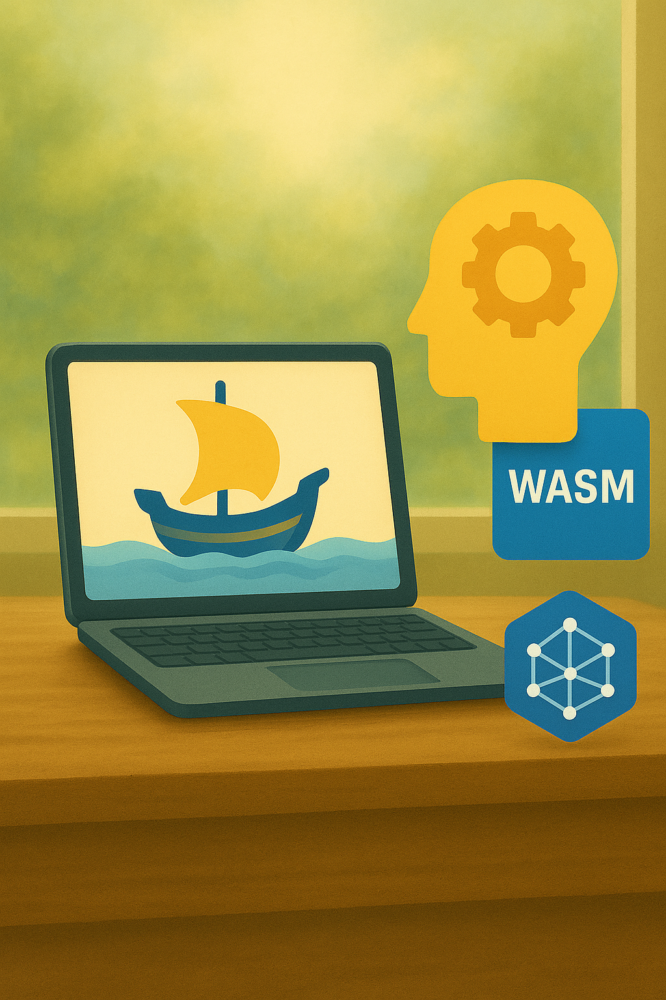
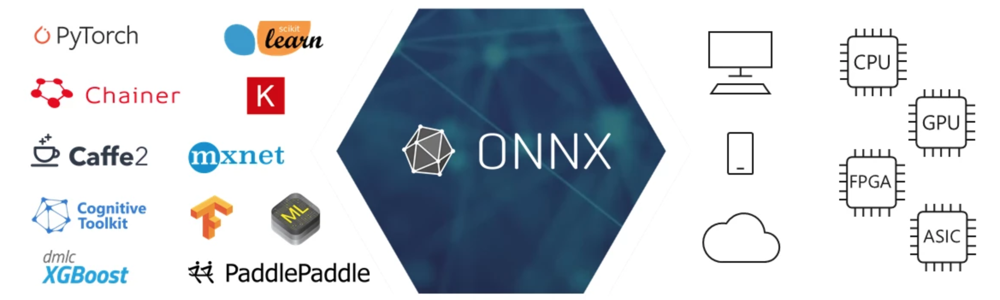
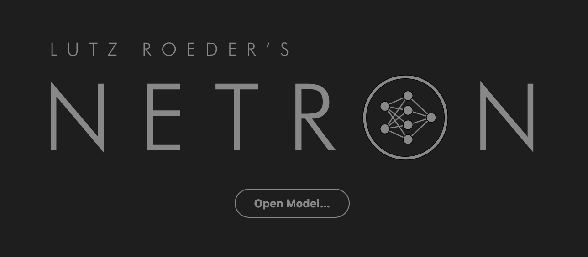
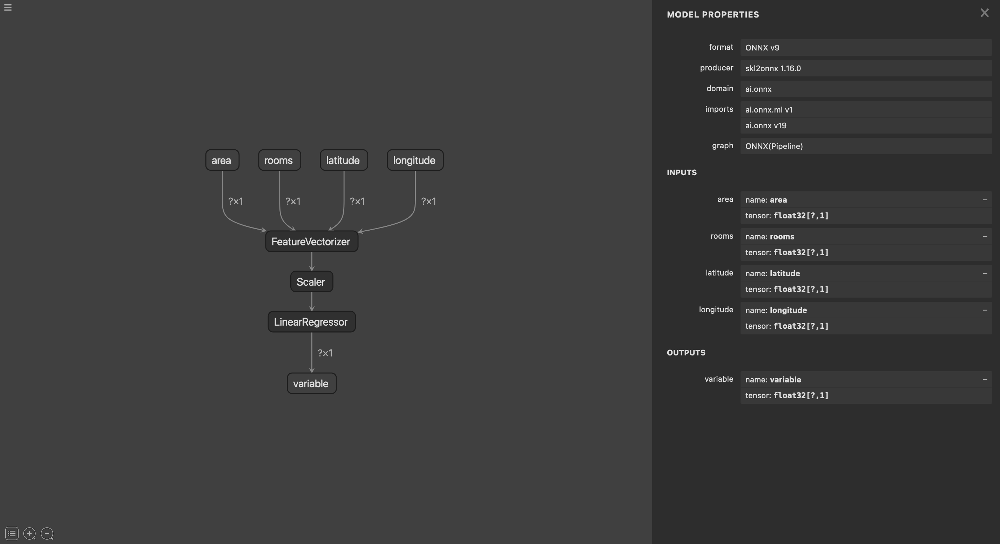

<!-- _header: "" -->
<!-- _footer: "" -->
<!-- _paginate: false -->

# Machine Learning in the Browser: Fast Iteration with ONNX & WebAssembly

> **Romain Clement**

> PyData Paris 2025
> October 1st 2025

<!--
Hello everyone, my name is Romain and today we are going to talk about machine learning models deployment, but let's take a road less travelled!
-->

---

<!-- _backgroundColor: #F6BC3B -->
<!-- _color: white -->
<!-- _header: "" -->
<!-- _footer: "" -->

# 🙋 Who is able to deploy ML models from day one?

<!--
Let's start with a simple question: please raise your hand if you are able to deploy machine learning models from day one?

And when I say "deploy", I mean by any means necessary so that someone other than the data science team itself can make use of it somehow...

...

Okay so as you can see, not so many people can do it. Let's understand why...
-->

---

## 🤕 Hard truth about ML models

Many surveys and field experience show :

- Most models never reach production
- Technical difficulties for integration
- Lack of user feedback
- Difficulty to showcase business value
- Privacy concerns

<!--
A lot of surveys and my own personal field experience bring to light the following major concerns regarding ML models:

- Most models never reach production (some numbers are saying something like 80% of models stay in notebooks)
- Data science and engineering teams are facing technical difficulties to collaborate and integrate said models
- A lack of user feedback leaves model at initial stage, without confrontation to the real world
- Stakeholders have a hard time understanding the business value brought by said models
- And lastly, privacy concerns are more and more expressed, and rightfully so.

How can we do better and make sure models go as far as they can in the industrialization process and reach their goals?
-->

---

## 💡 Can we do better?

💰 Deploy simple demos at no cost
⚙️ Use standard model interchange formats
🌍 Inference at the edge

<!--
Here are some ideas to alleviate some of them:

- Deploy simple demos at no cost and early-on: provide quick user feedback and showcase potential business value to stakeholders

- Use standard model interchange formats to ease the path to integration with engineering teams, and debunk integration issues early-on

- Make use of inference at the edge for cost-efficient (no infrastructure needed) and privacy-respecting deployments

Using these simple rules, we can already go a long way in solving some of the issues data teams are experiencing.
-->

---

## 💡 Can we do better?

<!--
TODO: add HTML/CSS/JS + ONNX + WASM logos
-->

💰 Deploy simple demos at no cost → **Static websites**
⚙️ Use standard model interchange formats → **ONNX**
🌍 Inference at the edge → **WebAssembly**

<!--
Okay but how do I go from there?

Here is a proposal to address each of these points:

- Static websites are easy to build, easy deploy at literally zero-cost and zero security risks (no backend server involved expecting for serving static assets such as HTML/CSS/JS)

- ONNX has been the current standard for ML model interchange format, providing a programming-language-agnostic representation of a computational graph

- The modern standard WebAssembly provides an efficient computation engine at the edge, and most notably in each an every web-browser

Let's go for a quick recap on ONNX and WebAssembly technologies before we can take it for a spin
-->

---

## ⚙️ What is ONNX?

[Open Neural Network Exchange][onnx]

- Generic ML model representation
- Common file format
- Training / inference loose coopling
- Language-agnostic
- Backend-agnostic
- Interoperability

<!--
So ONNX.

Stands for "Open Neural Network Exchange" but it applies to any computational graph you can describe with the builtin operators (which is almost anything at this point), not only neural networks.

I'm sure most of you know the format but let me give you a quick recap:
- Provides a common file format between training and inference stages
- You get loose coopling between training and inference implementations
- It is language and backend agnostic
- By that I mean that you get to train a model with any ML framework of your choice, export it to ONNX, and get automatic interoperability with any implementation consuming ONNX models, be it on a backend server, on a desktop app, a mobile app and even IoT devices! It is also compatible with accelerated hardware such as GPUs, TPUs, NPUs and custom chips.

Such standard interchange model format is a key enabler in reducing the friction with engineering teams try to integrate models into existing systems
-->

---

## 🤝 ONNX Models

Export models from favourite framework:

* Scikit-Learn: [sklearn-onnx][sklearn-onnx]
* Tensorflow: [tensorflow-onnx][tensorflow-onnx]
* PyTorch: [torch.onnx][torch-onnx]
* ... or build a custom graph with the [onnx][python-onnx]!

> ⚠️ Some models or layer types might not be supported by generic [operators][onnx-operators] yet!

---

## 🤝 ONNX Models

Using [Netron][netron] to visualize an ONNX model

<!--
The ecosystem around ONNX is great.

For instance, you can use the client-side webapp Netron to visualize your ONNX models
-->

---

<!-- _footer: "" -->

---

## 🤝 ONNX Runtime

* C/C++
* Python
* ...
* **Web**!

---

## 🌍 What is WebAssembly?

[WASM][webassembly]

- Portable compilation target
- Client and server applications
- Major browsers support (desktop, mobile)
- Fast, safe and open
- Privacy

> ⚠️ Some restrictions may apply, especially regarding available memory (4GB)

---

## 🌍 WebAssembly

Famous usage in Data Science ecosystem:

* [Pyodide][pyodide] (_Python in browser_)
* [JupyterLite][jupyterlite] (_JupyterLab in browser_)
* [PyScript][pyscript] (_Python in HTML_)
* **[ONNX Runtime Web][onnx-runtime-web]**!
* **[🤗 Transformers.js][transformersjs]**!

---

<!-- _backgroundColor: #f6ae3bff -->
<!-- _color: white -->

## Getting started with ONNX Runtime Web

**Housing value estimation demo**

✅ Train a regressor with Scikit-Learn
✅ Export it to ONNX
✅ Integrate it into a static website

Source: [`rclement/pydata-paris-2025-ml`](https://github.com/rclement/pydata-paris-2025-ml/tree/main/housing)

---

<!-- _backgroundColor: #f6ae3bff -->
<!-- _color: white -->

## Getting started with 🤗 Transformers.js

**Text summarizer demo**

✅ Pre-trained lightweight ONNX LLM ([Google Gemma 3 270m](https://huggingface.co/onnx-community/gemma-3-270m-it-ONNX) ~1GB)
✅ Integrate it into a static website

Source: [`rclement/pydata-paris-2025-ml`](https://github.com/rclement/pydata-paris-2025-ml/tree/main/text_summarizer)

---

## 🚢 Introducing `modelship`

Local-first utility Python app

Automate the generation of application from models

OSS Apache-2 licensed

Get started:
- `uvx modelship static --output dist --metadata metadata.yml model.onnx`
- https://github.com/datalpia/modelship

<!--
What if all we've done manually so far could be performed automatically? Like simply providing an ONNX model and some descriptive metadata about inputs and outputs tensors?

Let me introduce a new open-source project I have been experimenting with very recently: "modelship"

This is a local first Python utility application (in the form of a CLI)

It is open-source under the Apache-2 license.

For now it is very basic, but it allows to you to generate a static web application, with an autogenerated form for inputs and performs model inference using ONNX Runtime Web.

The easiest way to try it: "uvx modelship" (you can of course "pip install modelship")
-->

---

<!-- _backgroundColor: #f6ae3bff -->
<!-- _color: white -->

## 🚢 `modelship` demo

**Let's try to gap the "extra mile"**

✅ Build static web app from ONNX model and metadata
✅ Deploy on GitHub Pages using CI/CD

Source: [`rclement/pydata-paris-2025-modelship-demo`](https://github.com/rclement/pydata-paris-2025-modelship-demo)

---

<!-- _backgroundColor: #f6ae3bff -->
<!-- _color: white -->

## 🚢 `modelship` demo

Try the deployment yourself!

https://rclement.github.io/pydata-paris-2025-modelship-demo/

---

<!-- _backgroundColor: #207699 -->
<!-- _backgroundColor: #f6ae3bff -->
<!-- _color: white -->
<!-- _header: "" -->
<!-- _footer: "" -->

## 🚢 `modelship` demo

<iframe
    src="https://rclement.github.io/pydata-paris-2025-modelship-demo/"
    width="800"
    height="500"
    scrolling="yes"
    frameborder="0"
    webkitallowfullscreen
    mozallowfullscreen
    allowfullscreen
></iframe>

---

# 🚢 Takeaway

**Just start shipping!**

---

## Romain CLEMENT

Indepedent consultant at **Datalpia**

Meetup Python Grenoble co-organizer

🌐 [datalpia.com](https://datalpia.com)
🌐 [romain-clement.net](https://romain-clement.net)
🔗 [linkedin.com/in/romainclement](https://www.linkedin.com/in/romainclement)

---

# 🙋 Questions ?

Thank you! Let's chat!

<!--
Anticipated questions:
-->

---

## 📚 References

- [The Institute for Ethical AI & Machine Learning - The State of Production ML in 2024](https://ethical.institute/state-of-ml-2024.html)
- [KD Nuggets - Survey: Machine Learning Projects Still Routinely Fail to Deploy](https://www.kdnuggets.com/survey-machine-learning-projects-still-routinely-fail-to-deploy)
- [KD Nuggets - Models Are Rarely Deployed: An Industry-wide Failure in Machine Learning Leadership](https://www.kdnuggets.com/2022/01/models-rarely-deployed-industrywide-failure-machine-learning-leadership.html)
- [Wasm 3.0 Completed Announcement](https://webassembly.org/news/2025-09-17-wasm-3.0/)
- [ONNX Runtime Web documentation][onnx-runtime-web]
- [🤗 Transformers.js documentation][transformersjs]

[onnx]: https://onnx.ai
[onnx-operators]: https://onnx.ai/onnx/operators/
[onnx-runtime]: https://onnxruntime.ai
[onnx-runtime-web]: https://onnxruntime.ai/docs/get-started/with-javascript/web.html
[onnx-runtime-web-samples]: https://github.com/microsoft/onnxruntime-inference-examples
[python-onnx]: https://onnx.ai/onnx/intro/python.html
[netron]: https://netron.app
[sklearn-onnx]: https://onnx.ai/sklearn-onnx/
[tensorflow-onnx]: https://github.com/onnx/tensorflow-onnx
[torch-onnx]: https://pytorch.org/docs/stable/onnx.html
[webassembly]: https://webassembly.org
[pyodide]: https://pyodide.org
[jupyterlite]: https://jupyterlite.readthedocs.io
[pyscript]: https://pyscript.net
[transformersjs]: https://huggingface.co/docs/transformers.js