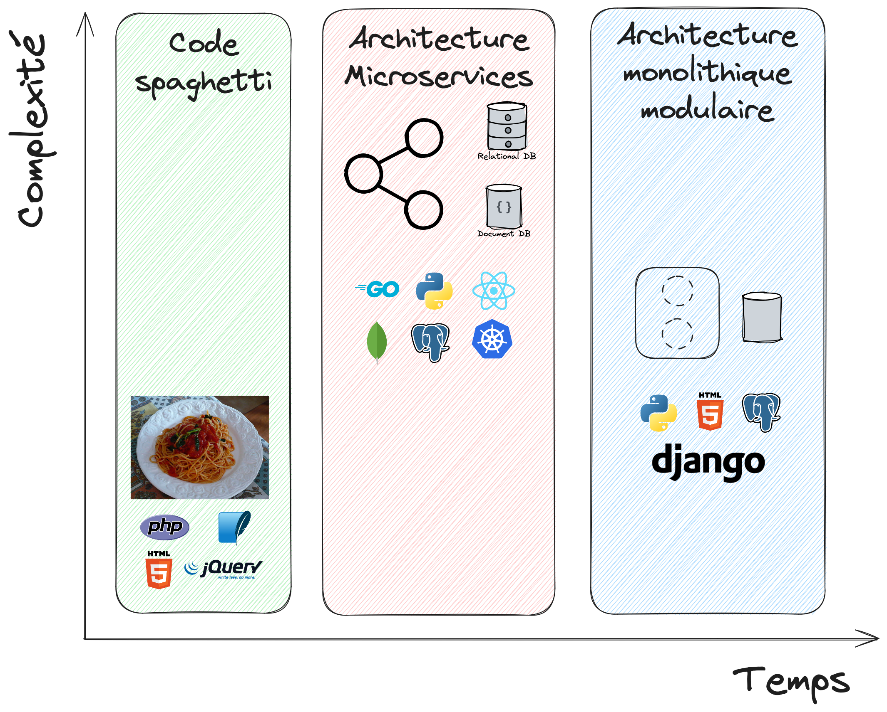
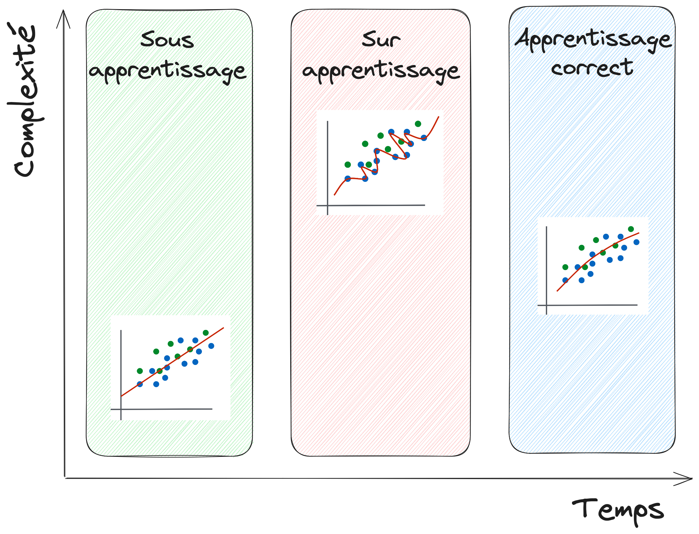
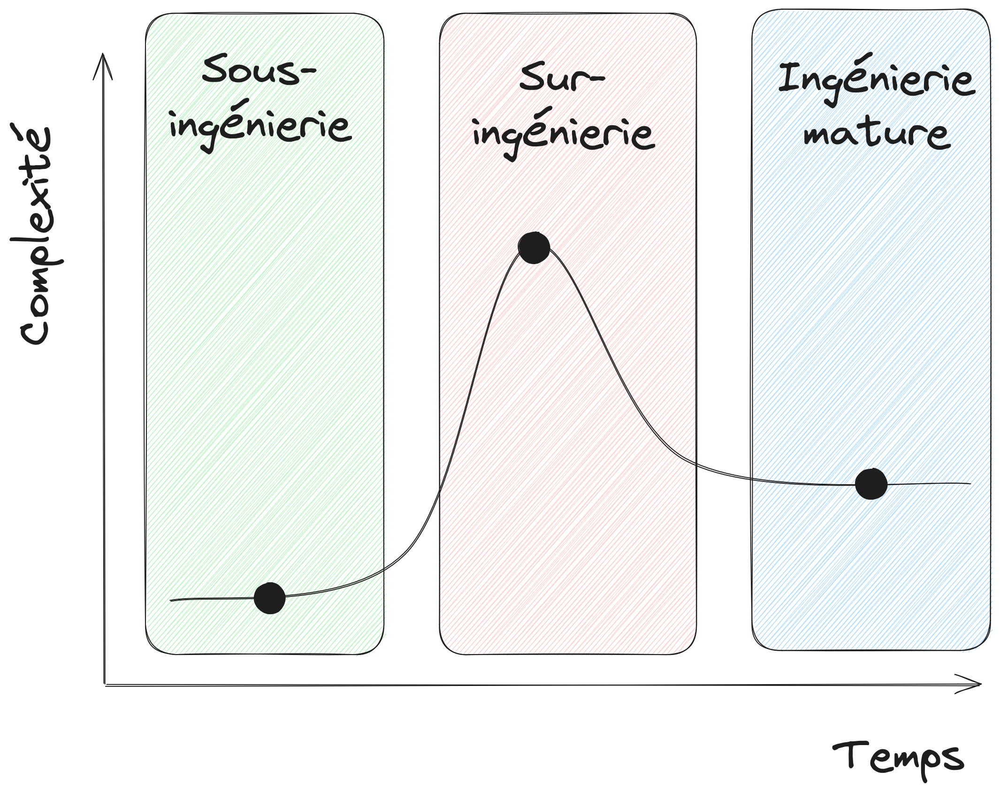

# Les 3 phases de l'ingénierie

> Romain Clement
> Human Talks Grenoble - 14 novembre 2023

---

## 🙋 Question

Qui a déjà travaillé sur un projet d'application web ?

---

## 🕸 Exemple : application web

1. Prototype rapide
2. Microservices
3. Monolithe modulaire

<!--
1. Aller droit au but, raccourcis pris, peu de considération d'architecture logicielle

2. Fortes considération techniques, d'architecture notamment pour concevoir un système évolutif et robuste

3. Compromis technologique entre simplicité, modularité, et maintenance facilité, utilisation de technologies et framework matures
-->

---

## 🙋 Question

Qui a déjà travaillé dans la _data science_ ?

---

## 🧪 Exemple : _data science_

1. Sous-apprentissage
2. Sur-apprentissage
3. Apprentissage correct

<!--
1. Modèle simple (heuristique, modèles linéaires), résultats satisfaisants / moyens mais permet de valider l'objectif

2. Modélisation avec architecture complexe (réseaux de neurones profonds), scores optimaux mais généralise difficilement, compréhension difficile

3. "Garbage-in garbage-out", focalisation sur les données, l'extraction de caractéristiques complexes couplées à un prédicteur simple
 -->
---

## 💡 Les 3 phases de l'ingenierie

1. Sous-ingénierie
2. Sur-ingénierie
3. Ingénierie mature

<!--
1. Sous-ingénierie :
   - Compréhension du besoin métier
   - Pro: Livraison rapide
   - Pro: Forte valeur ajoutée
   - Con: Raccourcis, dette technique
   - Con: Difficulté d'évolution

2. Sur-ingénierie :
   - Compréhension des limites techniques
   - Pro: Architecture
   - Pro: Stabilité
   - Con: Livraison lente
   - Con: Maintenance difficile
   - Con: On-boarding difficile

3. Ingénierie mature :
   - Compromis pour solution pérenne
   - Pro: Livraison rapide / moyenne
   - Pro: Valeur ajoutée moyenne / forte
   - Pro: Stabilité, facile à maintenir
   - Con: Demande de l'expérience
   - Con: Besoin cadrer les bonnes pratiques
-->

---

## 🎯 Prise de recul

- Identifier la phase courante
- Pas de fatalité
- Accepter le chemin
- Minimiser la phase de sur-ingénierie

<!--
Les 3 étapes sont généralement nécessaires, il faut l'accepter
 -->

---

## 📚 Références

- ["under-engineering, over-engineering, right-engineering", Martijn Faassen](https://blog.startifact.com/posts/older/under-engineering-over-engineering-right-engineering/)

---

## 👋 Romain CLEMENT

Entrepreneur individuel
Ingénieur et formateur
Data / Machine Learning / MLOps

Organisateur du Meetup Python Grenoble

🌐 [romain-clement.net](https://romain-clement.net)
🔗 [linkedin.com/in/romainclement](https://www.linkedin.com/in/romainclement)

