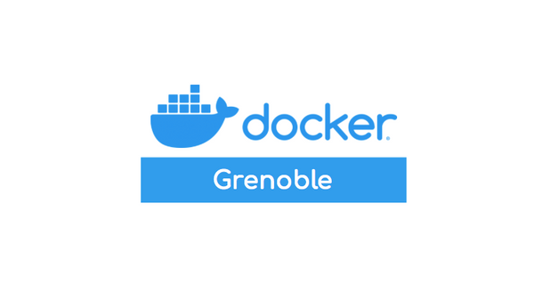

# The Swarm Factor

[{ align=right style="width: 20%" }][meetup]

Talk given on March 26, 2019 for Docker 6^th^ birthday, organized by the
[Docker Meetup Grenoble][meetup].

[:fontawesome-brands-meetup: Event on Meetup][event]  
[:fontawesome-brands-github: Demo on GitHub][repository]

## Summary

_The 12-factor Docker Swarm stacks_: an experiment to build a simple PaaS-like
developer experience on top of the Docker Swarm container orchestrator, using
the 12-factor cloud native applications best-practices.

## Slides

<iframe
    src="https://slides.com/rmnclmnt/swarm-factor/embed"
    width="600"
    height="340"
    scrolling="no"
    frameborder="0"
    webkitallowfullscreen
    mozallowfullscreen
    allowfullscreen
></iframe>

[meetup]: https://www.meetup.com/fr-FR/Docker-Grenoble/ "Docker Meetup Grenoble"
[event]: https://www.meetup.com/fr-FR/Docker-Grenoble/events/258790334/ "Meetup Event"
[slides]: https://slides.com/rmnclmnt/swarm-factor "The Swarm Factor - Slides"
[repository]: https://github.com/rclement/docker-swarm-stacks "GitHub Repository"
